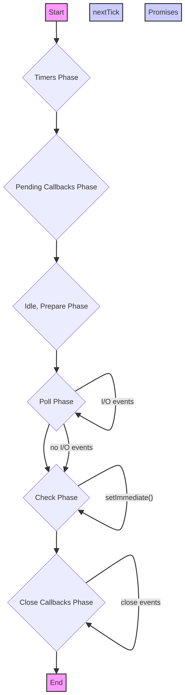
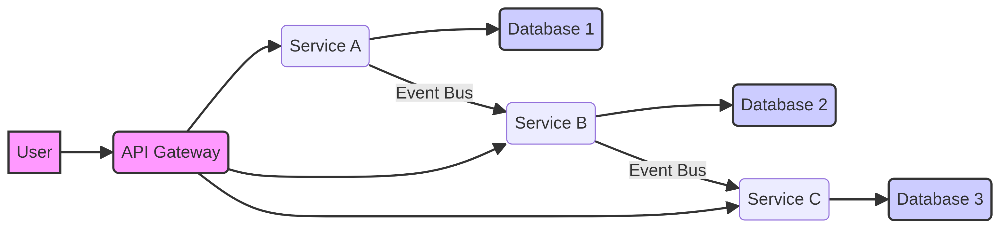

# Node.js Interview Questions & Answers — Complete Revision Guide

A comprehensive revision guide for Node.js interviews, covering everything from fundamental concepts to advanced architectural patterns.

## Table of Contents

- [🔥 Most Asked / Tricky Questions](#-most-asked--tricky-questions)

- [Node.js Basics](#nodejs-basics)
  - [Q: What is Node.js?](#q-what-is-nodejs)
  - [Q: Explain the Node.js Event Loop.](#q-explain-the-nodejs-event-loop)
  - [Q: What is the purpose of `package.json`?](#q-what-is-the-purpose-of-packagejson)
  - [Q: What are CommonJS modules?](#q-what-are-commonjs-modules)
  - [Q: What is the difference between `require` and `import`?](#q-what-is-the-difference-between-require-and-import)
  - [Q: How does `npm` work?](#q-how-does-npm-work)
  - [Q: Explain `process.nextTick()` and `setImmediate()`.](#q-explain-processnexttick-and-setimmediate)
  - [Q: What is a callback function?](#q-what-is-a-callback-function)
  - [Q: What are Promises in Node.js?](#q-what-are-promises-in-nodejs)
  - [Q: How do `async/await` work?](#q-how-do-asyncawait-work)
  - [Q: What is the V8 JavaScript engine?](#q-what-is-the-v8-javascript-engine)
  - [Q: Describe the single-threaded nature of Node.js.](#q-describe-the-single-threaded-nature-of-nodejs)

- [Core Modules & APIs](#core-modules--apis)
  - [Q: Name some core Node.js modules.](#q-name-some-core-nodejs-modules)
  - [Q: Explain the `fs` module.](#q-explain-the-fs-module)
  - [Q: How do you create an HTTP server in Node.js?](#q-how-do-you-create-an-http-server-in-nodejs)
  - [Q: What are Event Emitters?](#q-what-are-event-emitters)
  - [Q: Describe Node.js Streams.](#q-describe-nodejs-streams)
  - [Q: What is the `path` module used for?](#q-what-is-the-path-module-used-for)
  - [Q: Explain the `util` module.](#q-explain-the-util-module)
  - [Q: How do you access command-line arguments in Node.js?](#q-how-do-you-access-command-line-arguments-in-nodejs)
  - [Q: What is the `Buffer` class?](#q-what-is-the-buffer-class)
  - [Q: How do you handle file uploads in Node.js?](#q-how-do-you-handle-file-uploads-in-nodejs)
  - [Q: Explain the `child_process` module.](#q-explain-the-child_process-module)
  - [Q: What is the purpose of `crypto` module?](#q-what-is-the-purpose-of-crypto-module)

- [Express.js & Web Frameworks](#expressjs--web-frameworks)
  - [Q: What is Express.js?](#q-what-is-expressjs)
  - [Q: Explain middleware in Express.js.](#q-explain-middleware-in-expressjs)
  - [Q: How do you define routes in Express.js?](#q-how-do-you-define-routes-in-expressjs)
  - [Q: What is the purpose of `app.use()`?](#q-what-is-the-purpose-of-appuse)
  - [Q: How do you handle errors in Express.js?](#q-how-do-you-handle-errors-in-expressjs)
  - [Q: What are template engines in Express.js?](#q-what-are-template-engines-in-expressjs)
  - [Q: How do you serve static files in Express.js?](#q-how-do-you-serve-static-files-in-expressjs)
  - [Q: Explain `req.params`, `req.query`, and `req.body`.](#q-explain-reqparams-reqquery-and-reqbody)
  - [Q: What is a router in Express.js?](#q-what-is-a-router-in-expressjs)
  - [Q: How do you implement authentication in Express.js?](#q-how-do-you-implement-authentication-in-expressjs)
  - [Q: What are some alternatives to Express.js?](#q-what-are-some-alternatives-to-expressjs)
  - [Q: How do you secure an Express.js application?](#q-how-do-you-secure-an-expressjs-application)

- [Asynchronous Programming](#asynchronous-programming)
  - [Q: What is asynchronous programming?](#q-what-is-asynchronous-programming)
  - [Q: Explain callback hell and how to avoid it.](#q-explain-callback-hell-and-how-to-avoid-it)
  - [Q: What are the states of a Promise?](#q-what-are-the-states-of-a-promise)
  - [Q: How do `Promise.all()` and `Promise.race()` differ?](#q-how-do-promiseall-and-promiserace-differ)
  - [Q: What is the role of `await` keyword?](#q-what-is-the-role-of-await-keyword)
  - [Q: How do you handle errors in `async/await`?](#q-how-do-you-handle-errors-in-asyncawait)
  - [Q: Explain `EventEmitter` in detail.](#q-explain-eventemitter-in-detail)
  - [Q: What is the difference between concurrency and parallelism?](#q-what-is-the-difference-between-concurrency-and-parallelism)
  - [Q: How do you implement a custom Promise?](#q-how-do-you-implement-a-custom-promise)
  - [Q: What are async iterators and generators?](#q-what-are-async-iterators-and-generators)
  - [Q: Describe the `queueMicrotask()` function.](#q-describe-the-queuemicrotask-function)
  - [Q: How does Node.js handle I/O operations asynchronously?](#q-how-does-nodejs-handle-io-operations-asynchronously)

- [Databases & ORMs](#databases--orms)
  - [Q: How do you connect Node.js to a database?](#q-how-do-you-connect-nodejs-to-a-database)
  - [Q: What is an ORM/ODM?](#q-what-is-an-ormodm)
  - [Q: Explain Mongoose for MongoDB.](#q-explain-mongoose-for-mongodb)
  - [Q: What are schemas in Mongoose?](#q-what-are-schemas-in-mongoose)
  - [Q: How do you perform CRUD operations with Mongoose?](#q-how-do-you-perform-crud-operations-with-mongoose)
  - [Q: What is Sequelize for PostgreSQL/MySQL?](#q-what-is-sequelize-for-postgresqlmysql)
  - [Q: Explain migrations in Sequelize.](#q-explain-migrations-in-sequelize)
  - [Q: What is Redis and how is it used with Node.js?](#q-what-is-redis-and-how-is-it-used-with-nodejs)
  - [Q: Difference between SQL and NoSQL databases.](#q-difference-between-sql-and-nosql-databases)
  - [Q: How do you handle database transactions in Node.js?](#q-how-do-you-handle-database-transactions-in-nodejs)
  - [Q: What are some common database security practices?](#q-what-are-some-common-database-security-practices)
  - [Q: How do you optimize database queries in Node.js?](#q-how-do-you-optimize-database-queries-in-nodejs)

- [Authentication & Authorization](#authentication--authorization)
  - [Q: What is the difference between authentication and authorization?](#q-what-is-the-difference-between-authentication-and-authorization)
  - [Q: Explain JWT (JSON Web Tokens).](#q-explain-jwt-json-web-tokens)
  - [Q: How do you implement JWT in Node.js?](#q-how-do-you-implement-jwt-in-nodejs)
  - [Q: What are sessions and cookies?](#q-what-are-sessions-and-cookies)
  - [Q: Describe OAuth 2.0.](#q-describe-oauth-20)
  - [Q: How does Passport.js work?](#q-how-does-passportjs-work)
  - [Q: What are refresh tokens?](#q-what-are-refresh-tokens)
  - [Q: How do you store user passwords securely?](#q-how-do-you-store-user-passwords-securely)
  - [Q: Explain role-based access control (RBAC).](#q-explain-role-based-access-control-rbac)
  - [Q: What are some common authentication vulnerabilities?](#q-what-are-some-common-authentication-vulnerabilities)
  - [Q: How do you handle multi-factor authentication (MFA)?](#q-how-do-you-handle-multi-factor-authentication-mfa)
  - [Q: What is OpenID Connect?](#q-what-is-openid-connect)

- [Error Handling & Debugging](#error-handling--debugging)
  - [Q: How do you handle errors in Node.js?](#q-how-do-you-handle-errors-in-nodejs)
  - [Q: Explain `try-catch` blocks.](#q-explain-try-catch-blocks)
  - [Q: What are unhandled rejections and uncaught exceptions?](#q-what-are-unhandled-rejections-and-uncaught-exceptions)
  - [Q: How do you use `domain` module for error handling? (Deprecated)](#q-how-do-you-use-domain-module-for-error-handling-deprecated)
  - [Q: Describe custom error classes.](#q-describe-custom-error-classes)
  - [Q: How do you debug Node.js applications?](#q-how-do-you-debug-nodejs-applications)
  - [Q: What is the Node.js Inspector?](#q-what-is-the-nodejs-inspector)
  - [Q: How do you log errors effectively?](#q-how-do-you-log-errors-effectively)
  - [Q: Explain graceful shutdown.](#q-explain-graceful-shutdown)
  - [Q: What are common error handling patterns in Express.js?](#q-what-are-common-error-handling-patterns-in-expressjs)
  - [Q: How do you prevent memory leaks in Node.js?](#q-how-do-you-prevent-memory-leaks-in-nodejs)
  - [Q: What is a post-mortem debugging?](#q-what-is-a-post-mortem-debugging)

- [Testing](#testing)
  - [Q: Why is testing important in Node.js?](#q-why-is-testing-important-in-nodejs)
  - [Q: What are different types of testing?](#q-what-are-different-types-of-testing)
  - [Q: Explain Jest for Node.js testing.](#q-explain-jest-for-nodejs-testing)
  - [Q: How do you write unit tests with Jest?](#q-how-do-you-write-unit-tests-with-jest)
  - [Q: What is Mocha and Chai?](#q-what-is-mocha-and-chai)
  - [Q: How do you test Express.js APIs with Supertest?](#q-how-do-you-test-expressjs-apis-with-supertest)
  - [Q: What are mocks, stubs, and spies?](#q-what-are-mocks-stubs-and-spies)
  - [Q: Explain test-driven development (TDD).](#q-explain-test-driven-development-tdd)
  - [Q: How do you set up CI/CD for Node.js tests?](#q-how-do-you-set-up-cicd-for-nodejs-tests)
  - [Q: What is code coverage?](#q-what-is-code-coverage)
  - [Q: How do you test asynchronous code?](#q-how-do-you-test-asynchronous-code)
  - [Q: What are end-to-end (E2E) tests?](#q-what-are-end-to-end-e2e-tests)

- [Performance Optimization & Scalability](#performance-optimization--scalability)
  - [Q: How do you optimize Node.js application performance?](#q-how-do-you-optimize-nodejs-application-performance)
  - [Q: Explain Node.js Clustering.](#q-explain-nodejs-clustering)
  - [Q: What are Worker Threads?](#q-what-are-worker-threads)
  - [Q: How do you implement caching in Node.js?](#q-how-do-you-implement-caching-in-nodejs)
  - [Q: What is load balancing?](#q-what-is-load-balancing)
  - [Q: Describe Microservices architecture.](#q-describe-microservices-architecture)
  - [Q: How do you use a reverse proxy with Node.js?](#q-how-do-you-use-a-reverse-proxy-with-nodejs)
  - [Q: What are some common performance bottlenecks?](#q-what-are-some-common-performance-bottlenecks)
  - [Q: Explain connection pooling.](#q-explain-connection-pooling)
  - [Q: How do you monitor Node.js application performance?](#q-how-do-you-monitor-nodejs-application-performance)
  - [Q: What is event loop blocking?](#q-what-is-event-loop-blocking)
  - [Q: How do you scale a Node.js application horizontally and vertically?](#q-how-do-you-scale-a-nodejs-application-horizontally-and-vertically)

- [Security Best Practices](#security-best-practices)
  - [Q: What are common security vulnerabilities in Node.js?](#q-what-are-common-security-vulnerabilities-in-nodejs)
  - [Q: Explain OWASP Top 10.](#q-explain-owasp-top-10)
  - [Q: How do you prevent SQL Injection?](#q-how-do-you-prevent-sql-injection)
  - [Q: How do you prevent Cross-Site Scripting (XSS)?](#q-how-do-you-prevent-cross-site-scripting-xss)
  - [Q: How do you prevent Cross-Site Request Forgery (CSRF)?](#q-how-do-you-prevent-cross-site-request-forgery-csrf)
  - [Q: What is input validation?](#q-what-is-input-validation)
  - [Q: How do you secure API keys and sensitive information?](#q-how-do-you-secure-api-keys-and-sensitive-information)
  - [Q: Explain dependency scanning.](#q-explain-dependency-scanning)
  - [Q: What are security headers?](#q-what-are-security-headers)
  - [Q: How do you implement rate limiting?](#q-how-do-you-implement-rate-limiting)
  - [Q: What is a Content Security Policy (CSP)?](#q-what-is-a-content-security-policy-csp)
  - [Q: How do you handle HTTPS in Node.js?](#q-how-do-you-handle-https-in-nodejs)

- [Deployment & DevOps](#deployment--devops)
  - [Q: How do you deploy a Node.js application?](#q-how-do-you-deploy-a-nodejs-application)
  - [Q: Explain Docker for Node.js.](#q-explain-docker-for-nodejs)
  - [Q: How do you create a Dockerfile for a Node.js app?](#q-how-do-you-create-a-dockerfile-for-a-nodejs-app)
  - [Q: What is CI/CD?](#q-what-is-cicd)
  - [Q: Explain PM2.](#q-explain-pm2)
  - [Q: What are serverless functions (e.g., AWS Lambda)?](#q-what-are-serverless-functions-eg-aws-lambda)
  - [Q: How do you manage environment variables in production?](#q-how-do-you-manage-environment-variables-in-production)
  - [Q: What is Nginx and how is it used with Node.js?](#q-what-is-nginx-and-how-is-it-used-with-nodejs)
  - [Q: How do you monitor deployed Node.js applications?](#q-how-do-you-monitor-deployed-nodejs-applications)
  - [Q: Explain blue/green deployment.](#q-explain-bluegreen-deployment)
  - [Q: What are Kubernetes and containers?](#q-what-are-kubernetes-and-containers)
  - [Q: How do you handle zero-downtime deployments?](#q-how-do-you-handle-zero-downtime-deployments)

- [Advanced Concepts & Architecture](#advanced-concepts--architecture)
  - [Q: Explain Microservices architecture in detail.](#q-explain-microservices-architecture-in-detail)
  - [Q: What is GraphQL and how does it compare to REST?](#q-what-is-graphql-and-how-does-it-compare-to-rest)
  - [Q: How do you implement WebSockets in Node.js?](#q-how-do-you-implement-websockets-in-nodejs)
  - [Q: What is gRPC?](#q-what-is-grpc)
  - [Q: Explain event-driven architecture.](#q-explain-event-driven-architecture)
  - [Q: What are design patterns in Node.js?](#q-what-are-design-patterns-in-nodejs)
  - [Q: Describe the concept of a message queue (e.g., RabbitMQ, Kafka).](#q-describe-the-concept-of-a-message-queue-eg-rabbitmq-kafka)
  - [Q: What is a service mesh?](#q-what-is-a-service-mesh)
  - [Q: How do you handle distributed transactions?](#q-how-do-you-handle-distributed-transactions)
  - [Q: Explain CQRS and Event Sourcing.](#q-explain-cqrs-and-event-sourcing)
  - [Q: What is server-side rendering (SSR) with Node.js?](#q-what-is-server-side-rendering-ssr-with-nodejs)
  - [Q: How do you choose between different architectural styles?](#q-how-do-you-choose-between-different-architectural-styles)

- [Common Coding Challenges](#common-coding-challenges)
  - [Q: Implement a simple HTTP server.](#q-implement-a-simple-http-server)
  - [Q: Create a custom Event Emitter.](#q-create-a-custom-event-emitter)
  - [Q: Implement a rate limiter middleware.](#q-implement-a-rate-limiter-middleware)
  - [Q: Build a simple REST API with Express.js.](#q-build-a-simple-rest-api-with-expressjs)
  - [Q: Write a script to read a large file using streams.](#q-write-a-script-to-read-a-large-file-using-streams)
  - [Q: Implement a simple authentication system with JWT.](#q-implement-a-simple-authentication-system-with-jwt)
  - [Q: Create a basic chat application using WebSockets.](#q-create-a-basic-chat-application-using-websockets)
  - [Q: Implement a debouncing function.](#q-implement-a-debouncing-function)
  - [Q: Write a function to flatten a nested array.](#q-write-a-function-to-flatten-a-nested-array)
  - [Q: Implement a simple caching mechanism.](#q-implement-a-simple-caching-mechanism)
  - [Q: Create a task queue using `async` and `await`.](#q-create-a-task-queue-using-async-and-await)
  - [Q: Build a command-line tool.](#q-build-a-command-line-tool)

- [Behavioral/Scenario-based Questions](#behavioralscenario-based-questions)
  - [Q: Describe a challenging bug you fixed in a Node.js application.](#q-describe-a-challenging-bug-you-fixed-in-a-nodejs-application)
  - [Q: How would you handle a sudden spike in traffic to your Node.js application?](#q-how-would-you-handle-a-sudden-spike-in-traffic-to-your-nodejs-application)
  - [Q: What is your experience with microservices in Node.js?](#q-what-is-your-experience-with-microservices-in-nodejs)
  - [Q: How do you stay updated with the latest Node.js features and best practices?](#q-how-do-you-stay-updated-with-the-latest-nodejs-features-and-best-practices)
  - [Q: Describe a time you had to refactor a large Node.js codebase.](#q-describe-a-time-you-had-to-refactor-a-large-nodejs-codebase)
  - [Q: How do you ensure code quality in a team environment?](#q-how-do-you-ensure-code-quality-in-a-team-environment)
  - [Q: What are your thoughts on using TypeScript with Node.js?](#q-what-are-your-thoughts-on-using-typescript-with-nodejs)
  - [Q: How do you approach debugging a production issue?](#q-how-do-you-approach-debugging-a-production-issue)
  - [Q: Describe a project where you used a specific Node.js library or framework and why.](#q-describe-a-project-where-you-used-a-specific-nodejs-library-or-framework-and-why)
  - [Q: How do you handle conflicts or disagreements within a development team?](#q-how-do-you-handle-conflicts-or-disagreements-within-a-development-team)
  - [Q: What are the trade-offs of using a serverless architecture for Node.js?](#q-what-are-the-trade-offs-of-using-a-serverless-architecture-for-nodejs)
  - [Q: How do you design for fault tolerance in a distributed Node.js system?](#q-how-do-you-design-for-fault-tolerance-in-a-distributed-nodejs-system)

---

## 🔥 Most Asked / Tricky Questions

- [Explain the Node.js Event Loop.](#explain-the-nodejs-event-loop)

- [Difference between `process.nextTick()` and `setImmediate()`.](#difference-between-processnexttick-and-setimmediate)

- [How does `require()` work?](#how-does-require-work)

- [What are streams and why are they important?](#what-are-streams-and-why-are-they-important)

- [Explain middleware in Express.js.](#explain-middleware-in-expressjs)

- [What is callback hell and how to avoid it?](#what-is-callback-hell-and-how-to-avoid-it)

- [How do you handle errors in asynchronous code?](#how-do-you-handle-errors-in-asynchronous-code)

- [Difference between `cluster` and `worker_threads`.](#difference-between-cluster-and-worker_threads)

- [What is a microservice architecture?](#what-is-a-microservice-architecture)

- [How do you secure a Node.js application?](#how-do-you-secure-a-nodejs-application)

- [What is the V8 JavaScript engine?](#what-is-the-v8-javascript-engine)

- [Explain `Buffer` class.](#explain-buffer-class)

- [How do you optimize Node.js application performance?](#how-do-you-optimize-nodejs-application-performance)

- [What are unhandled rejections and uncaught exceptions?](#what-are-unhandled-rejections-and-uncaught-exceptions)

- [How do you test asynchronous code?](#how-do-you-test-asynchronous-code)

---

## Node.js Basics

### Q: What is Node.js?

Answer: Node.js is an open-source, cross-platform JavaScript runtime environment that executes JavaScript code outside a web browser. It allows developers to use JavaScript for server-side programming, building scalable network applications. Node.js uses the V8 JavaScript engine, which is also used in Google Chrome, to execute code efficiently.

### Q: Explain the Node.js Event Loop.

Answer: The Node.js Event Loop is a core component that handles asynchronous operations. It continuously checks for tasks in the call stack and moves them to the event queue. Once the call stack is empty, it processes tasks from the event queue. This non-blocking I/O model allows Node.js to handle many concurrent connections efficiently without creating a new thread for each.




### Q: What is the purpose of `package.json`?

Answer: `package.json` is a manifest file for Node.js projects. It contains metadata about the project (name, version, description, author), lists project dependencies (both `dependencies` and `devDependencies`), defines scripts for common tasks (e.g., `start`, `test`), and specifies the project's entry point. It's crucial for managing project dependencies and sharing projects.

### Q: What are CommonJS modules?

Answer: CommonJS is a module format used in Node.js for organizing and encapsulating code. Each file is treated as a separate module, and variables/functions defined within a module are private unless explicitly exported using `module.exports` or `exports`. Modules are imported using the `require()` function. This synchronous loading mechanism is suitable for server-side environments.

### Q: What is the difference between `require` and `import`?

Answer: `require` is used for CommonJS modules, which are synchronously loaded, typically in Node.js environments. `import` is part of ES Modules (ESM), which are asynchronously loaded and are the standard for modern JavaScript in browsers and increasingly in Node.js. ESM offers static analysis benefits, better tree-shaking, and explicit `import`/`export` syntax.

### Q: How does `npm` work?

Answer: `npm` (Node Package Manager) is the default package manager for Node.js. It allows developers to install, share, and manage project dependencies. When you run `npm install`, it reads `package.json` and `package-lock.json` to download and install packages from the npm registry into the `node_modules` directory. It also manages package versions and scripts.

### Q: Explain `process.nextTick()` and `setImmediate()`.

Answer: Both `process.nextTick()` and `setImmediate()` are used for scheduling asynchronous code. `process.nextTick()` callbacks are executed immediately after the current operation completes, before any I/O or timer events. `setImmediate()` callbacks are executed in thecheck phase of the event loop, after `process.nextTick()` and I/O events. `process.nextTick()` has higher priority and runs before `setImmediate()`.

### Q: What is a callback function?

Answer: A callback function is a function passed as an argument to another function, which is then invoked inside the outer function to complete some kind of routine or action. In Node.js, callbacks are fundamental for handling asynchronous operations, where a function starts an operation and provides a callback to be executed once the operation completes.

Example:

```javascript
function fetchData(callback) {
  setTimeout(() => {
    const data = "Some data";
    callback(null, data);
  }, 1000);
}

fetchData((error, data) => {
  if (error) {
    console.error(error);
  } else {
    console.log(data);
  }
});
```

### Q: What are Promises in Node.js?

Answer: Promises are objects that represent the eventual completion (or failure) of an asynchronous operation and its resulting value. They provide a cleaner and more manageable way to handle asynchronous code compared to traditional callbacks, helping to avoid "callback hell." A Promise can be in one of three states: pending, fulfilled (resolved), or rejected.

### Q: How do `async/await` work?

Answer: `async/await` is syntactic sugar built on top of Promises, making asynchronous code look and behave more like synchronous code. An `async` function always returns a Promise. The `await` keyword can only be used inside an `async` function to pause its execution until a Promise settles (resolves or rejects), and then resumes with the Promise's resolved value.

Example:

```javascript
async function getUserData(userId) {
  try {
    const user = await fetch(`/api/users/${userId}`);
    const userData = await user.json();
    const posts = await fetch(`/api/users/${userId}/posts`);
    const userPosts = await posts.json();
    return { userData, userPosts };
  } catch (error) {
    console.error("Error fetching data:", error);
    throw error;
  }
}
```

### Q: What is the V8 JavaScript engine?

Answer: V8 is Google's open-source high-performance JavaScript and WebAssembly engine, written in C++. It compiles JavaScript directly into native machine code before executing it, rather than using an interpreter. Node.js uses V8 to execute JavaScript code, providing fast execution speeds.

### Q: Describe the single-threaded nature of Node.js.

Answer: Node.js is often described as single-threaded because its JavaScript execution model is single-threaded. This means it processes one request at a time in its main event loop. However, Node.js leverages libuv, a C++ library, to handle I/O operations (like file system access, network requests) asynchronously in a thread pool, preventing the main thread from blocking. This architecture allows Node.js to achieve high concurrency.

---

## Core Modules & APIs

### Q: Name some core Node.js modules.

Answer: Node.js comes with several built-in modules that provide essential functionalities. Some key core modules include `fs` (File System), `http` (HTTP server/client ), `path` (path manipulation), `events` (Event Emitters), `util` (utility functions), `os` (Operating System information), `crypto` (cryptographic functionalities), and `child_process` (spawning child processes).

### Q: Explain the `fs` module.

Answer: The `fs` (File System) module provides an API for interacting with the file system in a way similar to standard POSIX functions. It allows you to read files, write files, create directories, delete files, and perform other file-related operations. Most `fs` methods have synchronous and asynchronous versions; asynchronous versions are generally preferred to avoid blocking the event loop.

Example (reading a file asynchronously):

```javascript
const fs = require('fs');

fs.readFile('example.txt', 'utf8', (err, data) => {
  if (err) {
    console.error('Error reading file:', err);
    return;
  }
  console.log('File content:', data);
});
```

### Q: How do you create an HTTP server in Node.js?

Answer: You can create an HTTP server in Node.js using the built-in `http` module. The `http.createServer( )` method takes a callback function that will be executed for every incoming request. This callback receives `request` and `response` objects, allowing you to handle requests and send responses.

Example:

```javascript
const http = require('http' );

const server = http.createServer((req, res ) => {
  res.statusCode = 200;
  res.setHeader('Content-Type', 'text/plain');
  res.end('Hello, World!\n');
});

server.listen(3000, '127.0.0.1', () => {
  console.log('Server running at http://127.0.0.1:3000/' );
});
```

### Q: What are Event Emitters?

Answer: Event Emitters are objects that can emit named events that cause previously registered functions (listeners) to be called. In Node.js, many built-in modules (like `fs`, `http`, `stream` ) inherit from `EventEmitter`. They are central to Node.js's event-driven architecture, allowing for loose coupling between different parts of an application.

Example:

```javascript
const EventEmitter = require('events');

class MyEmitter extends EventEmitter {}

const myEmitter = new MyEmitter();
myEmitter.on('event', () => {
  console.log('an event occurred!');
});
myEmitter.emit('event');
```

### Q: Describe Node.js Streams.

Answer: Streams are an abstract interface in Node.js for working with streaming data. They are a way to handle reading/writing files, network communications, or any kind of end-to-end information exchange in a more efficient manner, especially when dealing with large amounts of data. Streams can be readable, writable, duplex (both readable and writable), or transform (duplex streams that can modify data as it passes through). They reduce memory usage and improve performance by processing data in chunks.


### Q: What is the `path` module used for?

Answer: The `path` module provides utilities for working with file and directory paths. It offers methods to join path segments, resolve absolute paths, extract directory names, file names, and extensions from a path, and normalize paths. It's crucial for writing cross-platform compatible code as it handles differences in path delimiters (e.g., `\` on Windows, `/` on Unix).

Example:

```javascript
const path = require('path');

const fullPath = path.join('/users', 'john', 'documents', 'report.pdf');
console.log(fullPath); // Output: /users/john/documents/report.pdf (on Unix)

const fileName = path.basename(fullPath);
console.log(fileName); // Output: report.pdf
```

### Q: Explain the `util` module.

Answer: The `util` module provides utility functions that are helpful for Node.js programming. It includes functions for debugging, inspecting objects, formatting strings, and inheriting from `EventEmitter`. For example, `util.promisify()` is commonly used to convert callback-based functions into Promise-based functions, making them compatible with `async/await`.

Example (`util.promisify`):

```javascript
const util = require('util');
const fs = require('fs');

const readFilePromise = util.promisify(fs.readFile);

async function readMyFile() {
  try {
    const data = await readFilePromise('example.txt', 'utf8');
    console.log(data);
  } catch (err) {
    console.error('Error:', err);
  }
}
readMyFile();
```

### Q: How do you access command-line arguments in Node.js?

Answer: Command-line arguments in Node.js can be accessed using the `process.argv` global object. `process.argv` is an array where the first element is the path to the `node` executable, the second element is the path to the executed JavaScript file, and subsequent elements are the command-line arguments passed by the user.

Example:

```javascript
// To run: node app.js hello world
console.log(process.argv); 
// Output: ['/usr/local/bin/node', '/path/to/app.js', 'hello', 'world']

const args = process.argv.slice(2);
console.log('Arguments:', args); // Output: ['hello', 'world']
```

### Q: What is the `Buffer` class?

Answer: The `Buffer` class in Node.js is a global object that provides a way to handle binary data directly. It represents a raw binary data buffer, similar to an array of integers, but corresponds to a raw memory allocation outside the V8 heap. Buffers are commonly used for operations involving network protocols, file I/O, and interacting with binary data streams.

Example:

```javascript
const buf = Buffer.from('Hello Node.js!', 'utf8');
console.log(buf); // Output: <Buffer 48 65 6c 6c 6f 20 4e 6f 64 65 2e 6a 73 21>
console.log(buf.toString('hex')); // Output: 48656c6c6f204e6f64652e6a7321
```

### Q: How do you handle file uploads in Node.js?

Answer: Handling file uploads in Node.js typically involves using middleware like `multer` with Express.js. `multer` is a `node.js` middleware for handling `multipart/form-data`, which is primarily used for uploading files. It parses the incoming request and makes the file available in `req.file` or `req.files`.

Example (using Multer with Express):

```javascript
const express = require('express');
const multer = require('multer');
const app = express();

const upload = multer({ dest: 'uploads/' });

app.post('/upload', upload.single('avatar'), (req, res) => {
  console.log(req.file); // Information about the processed file
  res.send('File uploaded successfully!');
});

app.listen(3000, () => console.log('Server running on port 3000'));
```

### Q: Explain the `child_process` module.

Answer: The `child_process` module allows Node.js to spawn child processes, enabling it to run system commands or execute other programs. This is useful for performing CPU-intensive tasks in separate processes, thereby not blocking the Node.js event loop. Key methods include `spawn`, `exec`, `execFile`, and `fork`, each offering different ways to interact with child processes.

Example (`exec`):

```javascript
const { exec } = require('child_process');

exec('ls -lh', (error, stdout, stderr) => {
  if (error) {
    console.error(`exec error: ${error}`);
    return;
  }
  console.log(`stdout: ${stdout}`);
  console.error(`stderr: ${stderr}`);
});
```

### Q: What is the purpose of `crypto` module?

Answer: The `crypto` module provides cryptographic functionalities that include hashing, HMAC, encryption, decryption, signing, and verification. It's essential for implementing security features like password hashing, data encryption, and secure communication protocols within Node.js applications.

Example (hashing a password):

```javascript
const crypto = require('crypto');

function hashPassword(password) {
  const salt = crypto.randomBytes(16).toString('hex');
  const hash = crypto.pbkdf2Sync(password, salt, 10000, 64, 'sha512').toString('hex');
  return { salt, hash };
}

const { salt, hash } = hashPassword('mySecretPassword');
console.log('Salt:', salt);
console.log('Hash:', hash);
```

---

## Express.js & Web Frameworks

### Q: What is Express.js?

Answer: Express.js is a minimal and flexible Node.js web application framework that provides a robust set of features for web and mobile applications. It simplifies the process of building web servers and APIs by offering tools for routing, middleware integration, template engines, and more. It's one of the most popular frameworks for Node.js.

### Q: Explain middleware in Express.js.

Answer: Middleware functions are functions that have access to the `request` object (`req`), the `response` object (`res`), and the `next` middleware function in the application's request-response cycle. They can execute any code, make changes to the request and response objects, end the request-response cycle, or call the next middleware in the stack. Common uses include logging, authentication, body parsing, and error handling.

Example:

```javascript
const express = require('express');
const app = express();

// A simple logger middleware
app.use((req, res, next) => {
  console.log(`${req.method} ${req.url} at ${new Date()}`);
  next(); // Pass control to the next middleware function
});

app.get('/', (req, res) => {
  res.send('Hello from Express!');
});

app.listen(3000, () => console.log('Server running on port 3000'));
```

### Q: How do you define routes in Express.js?

Answer: Routes in Express.js are defined using methods like `app.get()`, `app.post()`, `app.put()`, `app.delete()`, etc., corresponding to HTTP methods. Each method takes a path and a callback function (or an array of callback functions, i.e., middleware) that handles the request for that specific route. Routes can also include parameters.

Example:

```javascript
const express = require('express');
const app = express();

app.get('/', (req, res) => {
  res.send('Home Page');
});

app.post('/users', (req, res) => {
  res.send('Create User');
});

app.get('/users/:id', (req, res) => {
  res.send(`User ID: ${req.params.id}`);
});

app.listen(3000, () => console.log('Server running on port 3000'));
```

### Q: What is the purpose of `app.use()`?

Answer: `app.use()` is used to mount middleware functions at a specified path. If no path is specified, the middleware is executed for every request to the app. It's commonly used for global middleware (like body parsers, static file serving, logging) or for applying middleware to a specific route or group of routes.

### Q: How do you handle errors in Express.js?

Answer: Error handling in Express.js is done via special middleware functions that take four arguments: `(err, req, res, next)`. When an error occurs, you can pass it to the `next()` function, and Express will skip all subsequent middleware and routing functions and execute the error-handling middleware. It's good practice to define a centralized error handler at the end of your middleware stack.

Example:

```javascript
app.use((err, req, res, next) => {
  console.error(err.stack);
  res.status(500).send('Something broke!');
});
```

### Q: What are template engines in Express.js?

Answer: Template engines (like Pug, EJS, Handlebars) allow you to use static template files in your application. At runtime, the template engine replaces variables in a template file with actual data from your application and transforms the template into an HTML file sent to the client. They are used for server-side rendering of dynamic web pages.

### Q: How do you serve static files in Express.js?

Answer: Express.js provides the `express.static` middleware function to serve static assets such as HTML files, images, CSS files, and JavaScript files. You specify the directory from which to serve static assets, and Express will automatically serve files from that directory when requested.

Example:

```javascript
const express = require('express');
const app = express();

app.use(express.static('public')); // Serves files from the 'public' directory

app.listen(3000, () => console.log('Server running on port 3000'));
// Now, you can access files like http://localhost:3000/images/logo.png if logo.png is in public/images
```

### Q: Explain `req.params`, `req.query`, and `req.body`.

Answer: These are properties of the `request` object in Express.js:

- `req.params`: Contains route parameters (e.g., `/users/:id` would have `req.params.id` ).

- `req.query`: Contains the query string parameters from the URL (e.g., `/search?q=nodejs` would have `req.query.q`).

- `req.body`: Contains the parsed request body, typically from `POST` or `PUT` requests. Requires middleware like `express.json()` or `express.urlencoded()` to parse the body content.

### Q: What is a router in Express.js?

Answer: An Express.js `Router` is a mini-application capable of performing middleware and routing functions. It allows you to modularize your routes and middleware, making your application more organized and maintainable, especially for larger applications. You can define routes on a router instance and then `app.use()` that router.

Example:

```javascript
const express = require('express');
const router = express.Router();

// middleware that is specific to this router
router.use((req, res, next) => {
  console.log('Time:', Date.now());
  next();
});

// define the home page route
router.get('/', (req, res) => {
  res.send('Birds home page');
});

module.exports = router;

// In app.js:
// const birds = require('./birds');
// app.use('/birds', birds);
```

### Q: How do you implement authentication in Express.js?

Answer: Authentication in Express.js typically involves using middleware. Common approaches include:

1. **Session-based authentication:** Using `express-session` to store user sessions on the server and cookies on the client.

1. **Token-based authentication:** Using JWTs (JSON Web Tokens) where a token is issued upon successful login and sent with subsequent requests for verification. Libraries like `jsonwebtoken` and `passport.js` are often used.

### Q: What are some alternatives to Express.js?

Answer: While Express.js is very popular, other Node.js web frameworks offer different features and philosophies. Some alternatives include:

- **Koa.js:** A more modern and minimal framework built by the creators of Express, leveraging `async/await` for better asynchronous control.

- **NestJS:** A progressive Node.js framework for building efficient, reliable, and scalable server-side applications, heavily inspired by Angular and using TypeScript.

- **Hapi.js:** A rich framework for building applications and services, known for its configuration-driven approach and strong focus on security and reliability.

- **Fastify:** A highly performant web framework focused on providing the best developer experience with minimal overhead.

### Q: How do you secure an Express.js application?

Answer: Securing an Express.js application involves several best practices:

- **Input Validation:** Validate all user input to prevent injection attacks (SQL, XSS).

- **Authentication & Authorization:** Implement robust authentication (e.g., JWT, OAuth) and authorization (RBAC).

- **HTTPS:** Always use HTTPS to encrypt communication.

- **Security Headers:** Use middleware like `helmet` to set various HTTP headers that help protect your app from common vulnerabilities.

- **Dependency Management:** Regularly update dependencies and scan for known vulnerabilities.

- **Error Handling:** Implement proper error handling to avoid leaking sensitive information.

- **Rate Limiting:** Protect against brute-force attacks and DoS by limiting request rates.

- **CORS:** Configure Cross-Origin Resource Sharing appropriately.

- **Environment Variables:** Store sensitive information (API keys, database credentials) in environment variables, not directly in code.

---

## Asynchronous Programming

### Q: What is asynchronous programming?

Answer: Asynchronous programming allows a program to start a potentially long-running task and still be responsive to other events while that task runs. Instead of waiting for the task to complete, the program continues execution and handles the result of the long-running task once it's ready, typically via callbacks, Promises, or `async/await`.

### Q: Explain callback hell and how to avoid it.

Answer: Callback hell (also known as the pyramid of doom) occurs when multiple nested asynchronous operations are handled with callbacks, leading to deeply indented, hard-to-read, and difficult-to-maintain code. It makes error handling and control flow complex. It can be avoided by using Promises, `async/await`, named functions, or event emitters.

Example (Callback Hell):

```javascript
fs.readFile('file1.txt', 'utf8', (err, data1) => {
  if (err) return console.error(err);
  fs.readFile('file2.txt', 'utf8', (err, data2) => {
    if (err) return console.error(err);
    fs.readFile('file3.txt', 'utf8', (err, data3) => {
      if (err) return console.error(err);
      console.log(data1, data2, data3);
    });
  });
});
```

Example (Avoiding with `async/await`):

```javascript
const util = require('util');
const readFilePromise = util.promisify(fs.readFile);

async function readFiles() {
  try {
    const data1 = await readFilePromise('file1.txt', 'utf8');
    const data2 = await readFilePromise('file2.txt', 'utf8');
    const data3 = await readFilePromise('file3.txt', 'utf8');
    console.log(data1, data2, data3);
  } catch (err) {
    console.error(err);
  }
}
readFiles();
```

### Q: What are the states of a Promise?

Answer: A Promise can be in one of three states:

1. **Pending:** Initial state, neither fulfilled nor rejected.

1. **Fulfilled (Resolved):** The operation completed successfully, and the Promise has a resulting value.

1. **Rejected:** The operation failed, and the Promise has a reason for the failure (an error).Once a Promise is fulfilled or rejected, it is said to be *settled* and its state cannot change again.

### Q: How do `Promise.all()` and `Promise.race()` differ?

Answer: Both are static methods on the `Promise` object that take an iterable of Promises:

- `Promise.all(iterable)`: Returns a single Promise that resolves when *all* of the Promises in the iterable have resolved, or rejects as soon as *any* of the Promises in the iterable rejects. The resolved value is an array of the resolved values of the input Promises, in the same order.

- `Promise.race(iterable)`: Returns a Promise that resolves or rejects as soon as *any* of the Promises in the iterable resolves or rejects, with the value or reason from that Promise. It's arace to see which Promise settles first.

### Q: What is the role of `await` keyword?

Answer: The `await` keyword can only be used inside an `async` function. It pauses the execution of the `async` function until the Promise it's waiting for settles (either resolves or rejects). If the Promise resolves, `await` returns the resolved value. If the Promise rejects, `await` throws the rejected value, which can then be caught by a `try...catch` block.

### Q: How do you handle errors in `async/await`?

Answer: Errors in `async/await` can be handled using traditional `try...catch` blocks, similar to synchronous code. Any rejected Promise within an `async` function will be caught by the nearest `catch` block. Alternatively, you can append `.catch()` to the `await` expression or the `async` function call.

Example:

```javascript
async function fetchData() {
  try {
    const response = await fetch("https://api.example.com/data" );
    if (!response.ok) {
      throw new Error(`HTTP error! status: ${response.status}`);
    }
    const data = await response.json();
    console.log(data);
  } catch (error) {
    console.error("Error fetching data:", error);
  }
}
fetchData();
```

### Q: Explain `EventEmitter` in detail.

Answer: `EventEmitter` is a class in Node.js that allows you to work with events. Objects that emit events are instances of `EventEmitter`. You can register functions (listeners) to be called when a specific event is emitted. This pattern is fundamental to Node.js's asynchronous nature and is used extensively in core modules (e.g., `http`, `fs`, `stream` ). It promotes a publish-subscribe model.

Example:

```javascript
const EventEmitter = require("events");
const myEmitter = new EventEmitter();

// Register a listener for 'userLoggedIn' event
myEmitter.on("userLoggedIn", (username) => {
  console.log(`${username} has logged in.`);
});

// Emit the 'userLoggedIn' event
myEmitter.emit("userLoggedIn", "Alice");
myEmitter.emit("userLoggedIn", "Bob");
```

### Q: What is the difference between concurrency and parallelism?

Answer:

- **Concurrency** means that multiple tasks can be in progress at the same time, but only one task is actually executing at any given instant (e.g., Node.js with its single-threaded event loop handles multiple I/O operations concurrently). It's about dealing with many things at once.

- **Parallelism** means that multiple tasks are actually executing simultaneously, typically on different CPU cores or processors. It's about doing many things at once. Node.js can achieve parallelism using `child_process` or `worker_threads`.

### Q: How do you implement a custom Promise?

Answer: Implementing a custom Promise involves understanding the Promise A+ specification. A basic custom Promise would involve a constructor that takes an `executor` function with `resolve` and `reject` arguments. It needs to manage internal state (pending, fulfilled, rejected) and a queue of `then` callbacks to be executed when the Promise settles. This is a complex task and usually not done in practice, but understanding it demonstrates deep knowledge of Promises.

### Q: What are async iterators and generators?

Answer:

- **Async Iterators** allow you to iterate over data asynchronously, typically when fetching data from a database or a stream. An object is an async iterator if it implements the `Symbol.asyncIterator` method, which returns an object with a `next()` method that returns a Promise for `{ value, done }`.

- **Async Generators** are functions declared with `async function*` that use `yield` to return Promises. They simplify the creation of async iterators, allowing you to write asynchronous iteration logic in a more sequential and readable manner.

### Q: Describe the `queueMicrotask()` function.

Answer: `queueMicrotask()` schedules a function to be executed in the microtask queue. Microtasks are executed after the currently executing script finishes and before the next task in the event loop begins. This means `queueMicrotask()` has higher priority than `setImmediate()` and `setTimeout(fn, 0)`, and its callbacks run before the next tick of the event loop's phases. It's useful for ensuring certain operations happen immediately after the current script but before any rendering or I/O.

### Q: How does Node.js handle I/O operations asynchronously?

Answer: Node.js handles I/O operations asynchronously through its event loop and the `libuv` library. When an I/O operation (like reading a file or making a network request) is initiated, Node.js offloads it to `libuv`'s thread pool. The main event loop continues processing other JavaScript code. Once the I/O operation completes, `libuv` places a callback in the event queue, which the event loop then picks up and executes, thus preventing the main thread from blocking.

---

## Databases & ORMs

### Q: How do you connect Node.js to a database?

Answer: Connecting Node.js to a database typically involves using a database driver or an ORM/ODM library. For SQL databases (like PostgreSQL, MySQL), you'd use drivers like `pg` or `mysql2`, or ORMs like Sequelize or TypeORM. For NoSQL databases (like MongoDB), you'd use an ODM like Mongoose. These libraries provide methods to establish connections, execute queries, and handle results.

Example (connecting to MongoDB with Mongoose):

```javascript
const mongoose = require("mongoose");

mongoose.connect("mongodb://localhost:27017/mydatabase", {
  useNewUrlParser: true,
  useUnifiedTopology: true,
})
.then(() => console.log("Connected to MongoDB"))
.catch((err) => console.error("Could not connect to MongoDB", err));
```

### Q: What is an ORM/ODM?

Answer:

- **ORM (Object-Relational Mapper):** A technique that lets you query and manipulate data from a database using an object-oriented paradigm. It maps objects in your code to tables in a relational database. Examples: Sequelize, TypeORM.

- **ODM (Object-Document Mapper):** Similar to an ORM but specifically designed for NoSQL document databases (like MongoDB). It maps objects in your code to documents in the database. Example: Mongoose.Both aim to abstract away raw SQL/NoSQL queries, making database interactions more intuitive and type-safe.

### Q: Explain Mongoose for MongoDB.

Answer: Mongoose is an Object Data Modeling (ODM) library for MongoDB and Node.js. It provides a schema-based solution to model your application data, enforcing a structure on the flexible MongoDB documents. Mongoose includes built-in type casting, validation, query building, and business logic hooks, making it easier to interact with MongoDB from Node.js applications.

### Q: What are schemas in Mongoose?

Answer: In Mongoose, a Schema defines the structure of the documents within a MongoDB collection. It specifies the fields, their data types, default values, validators, and other properties. While MongoDB is schemaless, Mongoose schemas provide a way to enforce data consistency and define relationships between collections, bringing a structured approach to document modeling.

Example:

```javascript
const mongoose = require("mongoose");
const { Schema } = mongoose;

const userSchema = new Schema({
  name: { type: String, required: true },
  email: { type: String, required: true, unique: true },
  age: { type: Number, min: 18 },
  createdAt: { type: Date, default: Date.now },
});

const User = mongoose.model("User", userSchema);
module.exports = User;
```

### Q: How do you perform CRUD operations with Mongoose?

Answer: Mongoose provides intuitive methods for CRUD (Create, Read, Update, Delete) operations:

- **Create:** `Model.create()`, `new Model().save()`

- **Read:** `Model.find()`, `Model.findOne()`, `Model.findById()`

- **Update:** `Model.updateOne()`, `Model.updateMany()`, `Model.findByIdAndUpdate()`

- **Delete:** `Model.deleteOne()`, `Model.deleteMany()`, `Model.findByIdAndDelete()`

Example:

```javascript
const User = require("./models/User"); // Assuming User model is defined

async function crudOperations() {
  try {
    // Create
    const newUser = await User.create({ name: "John Doe", email: "john@example.com", age: 30 });
    console.log("Created user:", newUser);

    // Read
    const users = await User.find({ age: { $gte: 25 } });
    console.log("Users over 25:", users);

    // Update
    const updatedUser = await User.findByIdAndUpdate(newUser._id, { age: 31 }, { new: true });
    console.log("Updated user:", updatedUser);

    // Delete
    await User.deleteOne({ _id: newUser._id });
    console.log("User deleted.");
  } catch (error) {
    console.error("CRUD operation failed:", error);
  }
}
crudOperations();
```

### Q: What is Sequelize for PostgreSQL/MySQL?

Answer: Sequelize is a powerful, Promise-based Node.js ORM for PostgreSQL, MySQL, MariaDB, SQLite, and Microsoft SQL Server. It provides a high-level abstraction over raw SQL queries, allowing developers to interact with relational databases using JavaScript objects. It supports transactions, associations, eager/lazy loading, and migrations.

### Q: Explain migrations in Sequelize.

Answer: Migrations in Sequelize are script files that describe changes to your database schema. They allow you to evolve your database schema over time in a controlled and versioned manner. Each migration typically has an `up` function (to apply changes, e.g., add a column) and a `down` function (to revert changes, e.g., remove a column). This is crucial for collaborative development and deployment.

### Q: What is Redis and how is it used with Node.js?

Answer: Redis is an open-source, in-memory data structure store, used as a database, cache, and message broker. It supports various data structures like strings, hashes, lists, sets, and sorted sets. In Node.js, Redis is commonly used for caching frequently accessed data, session management, real-time analytics, and implementing message queues, significantly improving application performance and scalability. Node.js clients like `ioredis` or `node-redis` are used to interact with it.

### Q: Difference between SQL and NoSQL databases.

Answer:

| Feature | SQL Databases | NoSQL Databases |
| --- | --- | --- |
| **Structure** | Relational, predefined schema (tables, rows) | Non-relational, dynamic schema (documents, key-value, graph, wide-column) |
| **Scalability** | Primarily vertical (scale up) | Primarily horizontal (scale out) |
| **ACID** | Strong ACID compliance | BASE consistency (Eventually Consistent) |
| **Examples** | MySQL, PostgreSQL, Oracle, SQL Server | MongoDB, Cassandra, Redis, DynamoDB |
| **Use Cases** | Complex transactions, structured data, reporting | Big data, real-time web apps, flexible data models |

### Q: How do you handle database transactions in Node.js?

Answer: Database transactions ensure that a series of database operations are treated as a single, atomic unit of work. If any operation within the transaction fails, all changes are rolled back. In Node.js, ORMs like Sequelize provide methods for managing transactions (e.g., `sequelize.transaction()`). For NoSQL databases like MongoDB, transactions are supported in replica sets and sharded clusters.

Example (Sequelize transaction):

```javascript
const { sequelize } = require("./models"); // Assuming sequelize instance

async function transferFunds(fromAccountId, toAccountId, amount) {
  const t = await sequelize.transaction();
  try {
    // Deduct from sender
    await Account.update({ balance: sequelize.literal(`balance - ${amount}`) }, {
      where: { id: fromAccountId },
      transaction: t,
    });

    // Add to receiver
    await Account.update({ balance: sequelize.literal(`balance + ${amount}`) }, {
      where: { id: toAccountId },
      transaction: t,
    });

    await t.commit();
    console.log("Funds transferred successfully!");
  } catch (error) {
    await t.rollback();
    console.error("Transaction failed:", error);
  }
}
```

### Q: What are some common database security practices?

Answer:

- **Input Validation:** Prevent SQL injection and other attacks by validating and sanitizing all user input.

- **Least Privilege:** Grant users and applications only the necessary permissions to perform their tasks.

- **Encryption:** Encrypt sensitive data at rest and in transit (e.g., using SSL/TLS for connections).

- **Strong Passwords & Hashing:** Use strong, unique passwords and hash them with robust algorithms (e.g., bcrypt) before storing.

- **Regular Backups:** Implement a reliable backup and recovery strategy.

- **Auditing & Logging:** Monitor database activity for suspicious behavior.

- **Network Security:** Use firewalls and network segmentation to restrict database access.

- **Keep Software Updated:** Apply security patches and updates to database software and drivers.

### Q: How do you optimize database queries in Node.js?

Answer: Optimizing database queries is crucial for application performance:

- **Indexing:** Create appropriate indexes on frequently queried columns.

- **Limit Data:** Fetch only the necessary columns and rows using `SELECT` specific columns and `LIMIT` clauses.

- **Pagination:** Implement pagination for large result sets.

- **Eager Loading:** Use eager loading (e.g., `include` in Sequelize, `populate` in Mongoose) to reduce N+1 query problems.

- **Connection Pooling:** Reuse database connections to reduce overhead.

- **Caching:** Cache frequently accessed data using in-memory caches (like Redis) or application-level caching.

- **Analyze Queries:** Use database-specific tools to analyze and optimize slow queries.

- **Denormalization:** For read-heavy workloads, consider denormalizing data to reduce joins.

---

## Authentication & Authorization

### Q: What is the difference between authentication and authorization?

Answer:

- **Authentication:** The process of verifying who a user is. It answers the question, "Are you who you say you are?" This typically involves checking credentials like username/password, biometric data, or tokens.

- **Authorization:** The process of determining what an authenticated user is allowed to do. It answers the question, "What are you allowed to access or do?" This involves checking permissions, roles, or access control lists.

### Q: Explain JWT (JSON Web Tokens).

Answer: JWTs are a compact, URL-safe means of representing claims to be transferred between two parties. They are often used for authentication and information exchange. A JWT consists of three parts separated by dots (`.`): a header, a payload, and a signature. The header and payload are Base64Url encoded JSON objects, and the signature is used to verify the token's authenticity. JWTs are stateless, meaning the server doesn't need to store session information.

### Q: How do you implement JWT in Node.js?

Answer: Implementing JWT in Node.js typically involves:

1. **Installation:** Install the `jsonwebtoken` library (`npm install jsonwebtoken`).

1. **Login/Registration:** When a user successfully logs in, create a JWT using `jwt.sign()` with a payload (e.g., user ID) and a secret key.

1. **Sending Token:** Send the JWT back to the client (e.g., in an HTTP-only cookie or as a Bearer token in the Authorization header).

1. **Protected Routes:** For protected routes, create a middleware that extracts the token, verifies it using `jwt.verify()` with the same secret key, and if valid, attaches the user information to the `req` object before calling `next()`.

Example (JWT creation):

```javascript
const jwt = require("jsonwebtoken");
const SECRET_KEY = "your_jwt_secret_key"; // Keep this secret!

function generateToken(user) {
  return jwt.sign({ id: user.id, email: user.email }, SECRET_KEY, { expiresIn: "1h" });
}

const token = generateToken({ id: "123", email: "test@example.com" });
console.log(token);
```

Example (JWT verification middleware):

```javascript
const jwt = require("jsonwebtoken");
const SECRET_KEY = "your_jwt_secret_key";

function authenticateToken(req, res, next) {
  const authHeader = req.headers["authorization"];
  const token = authHeader && authHeader.split(" ")[1];

  if (token == null) return res.sendStatus(401); // No token

  jwt.verify(token, SECRET_KEY, (err, user) => {
    if (err) return res.sendStatus(403); // Invalid token
    req.user = user;
    next();
  });
}

// Usage in Express:
// app.get('/protected', authenticateToken, (req, res) => {
//   res.json({ message: 'Welcome ' + req.user.email });
// });
```

### Q: What are sessions and cookies?

Answer:

- **Cookies:** Small pieces of data stored by the browser on the user's computer. They are sent with every request to the same domain. Used for tracking, personalization, and session management.

- **Sessions:** A way to store user-specific data on the server. When a user logs in, a session ID is generated and stored in a cookie on the client. This session ID is then used to retrieve the user's session data from the server on subsequent requests. Sessions are stateful, requiring server-side storage.

### Q: Describe OAuth 2.0.

Answer: OAuth 2.0 is an authorization framework that enables an application to obtain limited access to a user's account on an HTTP service (like Facebook, Google, GitHub). It works by delegating user authentication to the service that hosts the user account and authorizing third-party applications to access that user account. It's not an authentication protocol itself, but rather a framework for authorization, often used with OpenID Connect for authentication.

### Q: How does Passport.js work?

Answer: Passport.js is a popular authentication middleware for Node.js. It's flexible and modular, supporting various authentication strategies (local username/password, OAuth, JWT, etc.) throughstrategies. Passport.js handles the authentication flow, while you provide the logic for verifying credentials and serializing/deserializing user information.

### Q: What are refresh tokens?

Answer: Refresh tokens are long-lived credentials used to obtain new access tokens after the short-lived access token expires. Instead of requiring the user to re-authenticate, the client can send the refresh token to the authorization server to get a new access token. This improves user experience by reducing login frequency while maintaining security by limiting the exposure of access tokens.

### Q: How do you store user passwords securely?

Answer: User passwords should never be stored in plain text. Instead, they should be **hashed** using a strong, one-way cryptographic hashing algorithm (like bcrypt, scrypt, or Argon2) with a **salt**. Salting adds a random string to each password before hashing, preventing rainbow table attacks. The hash and salt are stored, not the original password. When a user attempts to log in, the provided password is hashed with the stored salt and compared to the stored hash.

### Q: Explain role-based access control (RBAC).

Answer: Role-Based Access Control (RBAC) is a method of restricting system access based on the roles of individual users within an enterprise. In RBAC, permissions are associated with roles (e.g., "admin", "editor", "viewer"), and users are assigned to one or more roles. This simplifies managing permissions, as you only need to assign roles to users rather than individual permissions.

### Q: What are some common authentication vulnerabilities?

Answer: Common authentication vulnerabilities include:

- **Brute-force attacks:** Attackers try many password combinations.

- **Credential stuffing:** Using leaked credentials from one site to gain access to another.

- **Weak or default passwords:** Easily guessable passwords.

- **Session hijacking:** Stealing a user's session ID to impersonate them.

- **Lack of MFA:** Multi-factor authentication adds an extra layer of security.

- **Insecure password storage:** Storing passwords in plain text or using weak hashing.

- **Broken authentication:** Flaws in the authentication logic allowing attackers to bypass it.

### Q: How do you handle multi-factor authentication (MFA)?

Answer: Multi-factor authentication (MFA) adds an extra layer of security by requiring users to provide two or more verification factors to gain access to an application. This typically involves something the user *knows* (password), something the user *has* (phone, hardware token), and/or something the user *is* (biometrics). In Node.js, MFA can be implemented using libraries that support TOTP (Time-based One-Time Password) or integrating with third-party MFA providers.

### Q: What is OpenID Connect?

Answer: OpenID Connect (OIDC) is an authentication layer built on top of the OAuth 2.0 authorization framework. It allows clients to verify the identity of the end-user based on the authentication performed by an Authorization Server, as well as to obtain basic profile information about the end-user in an interoperable and REST-like manner. OIDC provides an `ID Token` (a JWT) that contains claims about the authenticated user.

---

## Error Handling & Debugging

### Q: How do you handle errors in Node.js?

Answer: Error handling in Node.js is crucial for building robust applications. It involves using `try...catch` blocks for synchronous code, handling errors passed to callbacks in asynchronous operations, using `.catch()` with Promises, and implementing global error handlers for unhandled exceptions and rejections. Proper error handling prevents application crashes and provides meaningful feedback.

### Q: Explain `try-catch` blocks.

Answer: `try...catch` blocks are used for synchronous error handling in JavaScript. Code that might throw an error is placed inside the `try` block. If an error occurs, execution immediately jumps to the `catch` block, where the error can be handled. This prevents the program from crashing and allows for graceful degradation.

Example:

```javascript
try {
  const result = JSON.parse("{invalid json");
  console.log(result);
} catch (error) {
  console.error("Parsing error:", error.message);
}
```

### Q: What are unhandled rejections and uncaught exceptions?

Answer:

- **Unhandled Rejections:** Occur when a Promise is rejected, and there is no `.catch()` handler (or `try...catch` in an `async` function) to handle that rejection. In Node.js, unhandled rejections can lead to process termination in newer versions if not explicitly handled.

- **Uncaught Exceptions:** Occur when a synchronous error is thrown, and there is no `try...catch` block to catch it. If an uncaught exception reaches the event loop, it will typically crash the Node.js process.

Node.js provides `process.on("unhandledRejection")` and `process.on("uncaughtException")` to catch these global errors.

### Q: How do you use `domain` module for error handling? (Deprecated)

Answer: The `domain` module was an attempt to handle multiple asynchronous operations as a single group, allowing errors to be caught for all operations within that domain. However, it has been **deprecated** due to its complexity and issues with reliability, especially with Promises. Modern Node.js applications should rely on `try...catch` with `async/await`, Promise `.catch()` handlers, and global `process.on("unhandledRejection")` and `process.on("uncaughtException")` for comprehensive error handling.

### Q: Describe custom error classes.

Answer: Custom error classes allow you to create specific types of errors that inherit from JavaScript's built-in `Error` class. This provides more semantic meaning to errors, making them easier to identify, categorize, and handle programmatically. You can add custom properties to these error classes to provide more context about the error.

Example:

```javascript
class ValidationError extends Error {
  constructor(message, field) {
    super(message);
    this.name = "ValidationError";
    this.field = field;
  }
}

function validateInput(input) {
  if (!input.username) {
    throw new ValidationError("Username is required", "username");
  }
  // ... more validation
}

try {
  validateInput({});
} catch (error) {
  if (error instanceof ValidationError) {
    console.error(`Validation Error on field ${error.field}: ${error.message}`);
  } else {
    console.error("An unexpected error occurred:", error);
  }
}
```

### Q: How do you debug Node.js applications?

Answer: Node.js applications can be debugged using:

- **`console.log()`****:** Simple but effective for inspecting variable values.

- **Node.js Inspector:** Built-in debugger accessible via `node --inspect <file.js>`. It exposes a V8 Inspector Protocol endpoint, allowing debugging with Chrome DevTools or IDEs like VS Code.

- **IDE Debuggers:** Most modern IDEs (VS Code, WebStorm) have excellent built-in debugging tools that integrate with the Node.js Inspector.

- **`debugger`**** keyword:** Inserts a breakpoint in your code, pausing execution when the debugger is attached.

### Q: What is the Node.js Inspector?

Answer: The Node.js Inspector is a debugging utility that allows you to debug Node.js applications using the Chrome DevTools UI or other tools that support the V8 Inspector Protocol. You enable it by running your Node.js application with `node --inspect` or `node --inspect-brk` (for pausing at the first line). It provides features like breakpoints, step-through execution, variable inspection, and profiling.

### Q: How do you log errors effectively?

Answer: Effective error logging involves:

- **Using a dedicated logging library:** Libraries like Winston or Pino provide structured logging, different log levels (info, warn, error), and transport options (console, file, external services).

- **Contextual information:** Include relevant data like request ID, user ID, timestamp, stack trace, and environment details.

- **Log levels:** Use appropriate log levels to filter and prioritize messages.

- **Centralized logging:** Send logs to a centralized logging system (e.g., ELK stack, Splunk) for easier analysis and monitoring.

- **Avoid sensitive data:** Do not log sensitive user information.

### Q: Explain graceful shutdown.

Answer: Graceful shutdown is the process of allowing a running application to finish its current tasks and release resources before terminating. For a Node.js server, this means stopping new incoming requests, allowing existing requests to complete, closing database connections, and cleaning up any open file handles or timers. This prevents data loss and ensures a smooth user experience during deployments or restarts. It typically involves listening for `SIGTERM` or `SIGINT` signals.

Example:

```javascript
process.on("SIGTERM", () => {
  console.log("SIGTERM signal received: closing HTTP server");
  server.close(() => {
    console.log("HTTP server closed");
    // Close database connections, etc.
    process.exit(0);
  });
});
```

### Q: What are common error handling patterns in Express.js?

Answer: Common error handling patterns in Express.js include:

- **Middleware:** Using a dedicated error-handling middleware function `(err, req, res, next)` at the end of the middleware stack.

- **Async/Await with ****`try...catch`****:** For route handlers and middleware that use `async/await`, wrap the logic in `try...catch` blocks.

- **`express-async-errors`**** or ****`express-promise-router`****:** Libraries that automatically catch errors from async route handlers without needing explicit `try...catch` in each handler.

- **Custom Error Classes:** Creating specific error types for different scenarios.

- **Centralized Error Logging:** Logging errors to a central system.

### Q: How do you prevent memory leaks in Node.js?

Answer: Memory leaks in Node.js can occur due to unclosed event listeners, global variables holding large objects, improper caching, or unhandled errors. Prevention strategies include:

- **Remove event listeners:** Always remove listeners when they are no longer needed.

- **Clear timers:** Clear `setTimeout` and `setInterval` when done.

- **Limit cache size:** Implement LRU (Least Recently Used) or other eviction policies for caches.

- **Avoid global variables:** Minimize the use of global variables, especially for large data structures.

- **Monitor memory usage:** Use tools like Node.js `process.memoryUsage()` or external monitoring tools.

- **Profile with Chrome DevTools:** Use the Heap Snapshot feature to identify memory retention issues.

### Q: What is a post-mortem debugging?

Answer: Post-mortem debugging is the process of analyzing the state of an application *after* it has crashed. This typically involves generating a core dump or heap snapshot at the time of the crash and then using specialized tools (like `llnode` or Chrome DevTools with a heap snapshot) to inspect the application's memory, call stack, and variable values to determine the root cause of the failure. It's particularly useful for production environments where live debugging is not feasible.

---

## Testing

### Q: Why is testing important in Node.js?

Answer: Testing is crucial in Node.js (and any software development) for several reasons:

- **Ensures correctness:** Verifies that the code behaves as expected.

- **Prevents regressions:** Catches bugs introduced by new changes.

- **Facilitates refactoring:** Provides confidence to make changes without breaking existing functionality.

- **Improves code quality:** Encourages modular, testable code.

- **Documentation:** Tests serve as living documentation of how the code should work.

- **Reduces bugs in production:** Leads to more stable and reliable applications.

### Q: What are different types of testing?

Answer: Common types of testing include:

- **Unit Testing:** Testing individual, isolated units of code (functions, modules).

- **Integration Testing:** Testing how different units or modules interact with each other (e.g., database interactions, API calls).

- **End-to-End (E2E) Testing:** Testing the entire application flow from a user's perspective, often involving a browser or API client.

- **Functional Testing:** Verifying that the application meets specified functional requirements.

- **Performance Testing:** Assessing the application's speed, responsiveness, and stability under various loads.

- **Security Testing:** Identifying vulnerabilities and weaknesses.

### Q: Explain Jest for Node.js testing.

Answer: Jest is a popular, open-source JavaScript testing framework developed by Facebook. It's known for its simplicity, speed, and comprehensive features, including a built-in assertion library, mocking capabilities, code coverage reporting, and snapshot testing. Jest is often used for unit and integration testing of Node.js applications.

### Q: How do you write unit tests with Jest?

Answer: With Jest, you write test files (e.g., `*.test.js` or `*.spec.js`) that contain `describe` blocks for grouping tests and `it` or `test` blocks for individual test cases. You use `expect` assertions to verify outcomes. Jest provides powerful mocking utilities for isolating units under test.

Example:

```javascript
// math.js
function add(a, b) {
  return a + b;
}
module.exports = add;

// math.test.js
const add = require("./math");

describe("add function", () => {
  test("should add two numbers correctly", () => {
    expect(add(1, 2)).toBe(3);
  });

  test("should handle negative numbers", () => {
    expect(add(-1, 5)).toBe(4);
  });
});
```

### Q: What is Mocha and Chai?

Answer:

- **Mocha:** A JavaScript test framework that runs on Node.js and in the browser. It provides hooks for setting up and tearing down tests, and it's known for its flexibility, allowing you to choose your assertion library.

- **Chai:** An assertion library often paired with Mocha. It provides various assertion styles (e.g., `expect`, `should`, `assert`) to make tests more readable and expressive.

### Q: How do you test Express.js APIs with Supertest?

Answer: Supertest is a library that provides a high-level abstraction for testing HTTP servers, making it easy to test Express.js APIs. It wraps around SuperAgent and allows you to make HTTP requests to your Express app and assert on the responses (status codes, headers, body content).

Example:

```javascript
const request = require("supertest");
const app = require("../app"); // Your Express app

describe("GET /users", () => {
  it("should return all users", async () => {
    const res = await request(app).get("/users");
    expect(res.statusCode).toEqual(200);
    expect(res.body).toHaveProperty("length");
    expect(Array.isArray(res.body)).toBe(true);
  });
});
```

### Q: What are mocks, stubs, and spies?

Answer: These are test doubles used to control the behavior of dependencies during testing:

- **Mocks:** Objects that record calls made to them and have pre-programmed expectations. They verify interactions.

- **Stubs:** Objects that provide canned answers to calls made during the test, but do not verify interactions.

- **Spies:** Functions that record arguments, return values, and `this` context for all calls. They allow you to inspect how a function was called without altering its behavior.

Jest provides `jest.fn()` for creating mocks/spies and `jest.mock()` for mocking modules.

### Q: Explain test-driven development (TDD).

Answer: Test-Driven Development (TDD) is a software development process where tests are written *before* the code they are meant to test. The cycle is:

1. **Red:** Write a failing test for a new feature or bug fix.

1. **Green:** Write just enough code to make the test pass.

1. **Refactor:** Improve the code while ensuring all tests still pass.This iterative process leads to cleaner, more robust, and well-tested code.

### Q: How do you set up CI/CD for Node.js tests?

Answer: Setting up CI/CD (Continuous Integration/Continuous Deployment) for Node.js tests involves automating the process of building, testing, and deploying your application. Common steps include:

1. **Version Control:** Store code in a repository (e.g., Git).

1. **CI Server:** Use a CI tool (e.g., GitHub Actions, GitLab CI, Jenkins) to trigger builds on every code push.

1. **Build Stage:** Install dependencies (`npm install`).

1. **Test Stage:** Run unit, integration, and E2E tests (`npm test`).

1. **Code Quality:** Run linters, formatters, and security scans.

1. **Deployment:** If all tests pass, deploy the application to a staging or production environment.

### Q: What is code coverage?

Answer: Code coverage is a metric that measures the percentage of your codebase that is executed by your tests. It indicates how much of your code is being tested. While high code coverage is generally desirable, it doesn't guarantee the quality or correctness of the tests themselves. Tools like Istanbul (often integrated with Jest) are used to generate code coverage reports.

### Q: How do you test asynchronous code?

Answer: Testing asynchronous code requires special handling to ensure that tests wait for asynchronous operations to complete before asserting results. Common approaches include:

- **Callbacks:** Passing a `done` callback to the test function and calling it when the async operation finishes.

- **Promises:** Returning a Promise from the test function; Jest will wait for the Promise to resolve or reject.

- **`async/await`****:** Using `async` test functions and `await`ing Promises within them.

- **Timers:** Using `jest.useFakeTimers()` to control `setTimeout` and `setInterval`.

Example (`async/await` test):

```javascript
describe("fetchData", () => {
  it("should fetch data successfully", async () => {
    const data = await fetchDataFromAPI(); // Assume fetchDataFromAPI returns a Promise
    expect(data).toEqual({ message: "success" });
  });
});
```

### Q: What are end-to-end (E2E) tests?

Answer: End-to-end (E2E) tests verify the entire application flow from start to finish, simulating real user scenarios. They interact with the application through its user interface (or API for backend E2E) and verify that all integrated components (frontend, backend, database) work together as expected. Tools like Cypress, Playwright, or Selenium are commonly used for E2E testing of web applications.

---

## Performance Optimization & Scalability

### Q: How do you optimize Node.js application performance?

Answer: Optimizing Node.js performance involves several strategies:

- **Asynchronous I/O:** Leverage Node.js's non-blocking nature for I/O operations.

- **Clustering/Worker Threads:** Utilize multiple CPU cores for CPU-bound tasks.

- **Caching:** Implement caching (in-memory, Redis) for frequently accessed data.

- **Database Optimization:** Optimize queries, use indexing, connection pooling.

- **Load Balancing:** Distribute traffic across multiple instances.

- **Profiling:** Use tools like Node.js Inspector, `clinic.js` to identify bottlenecks.

- **Efficient Algorithms:** Use optimized algorithms and data structures.

- **Minimize Blocking Operations:** Avoid synchronous functions where possible.

- **Gzip Compression:** Compress HTTP responses.

- **Keep Dependencies Updated:** Newer versions often include performance improvements.

### Q: Explain Node.js Clustering.

Answer: Node.js Clustering allows you to take advantage of multi-core systems by spawning multiple Node.js processes (workers) that share the same server port. The `cluster` module handles distributing incoming connections among these worker processes. Each worker runs in its own V8 instance, providing better performance for CPU-bound tasks and increased fault tolerance, as a crash in one worker doesn't bring down the entire application.

Example:

```javascript
const cluster = require("cluster");
const http = require("http" );
const numCPUs = require("os").cpus().length;

if (cluster.isMaster) {
  console.log(`Master ${process.pid} is running`);

  for (let i = 0; i < numCPUs; i++) {
    cluster.fork();
  }

  cluster.on("exit", (worker, code, signal) => {
    console.log(`worker ${worker.process.pid} died`);
    cluster.fork(); // Replace the dead worker
  });
} else {
  http.createServer((req, res ) => {
    res.writeHead(200);
    res.end("hello world\n");
  }).listen(8000);

  console.log(`Worker ${process.pid} started`);
}
```

### Q: What are Worker Threads?

Answer: Worker Threads (introduced in Node.js v10.5.0) allow you to run CPU-intensive JavaScript operations in separate threads, isolating them from the main event loop. Unlike `child_process`, worker threads share memory (via `SharedArrayBuffer`), making data exchange more efficient. They are ideal for performing heavy computations without blocking the main thread, improving the responsiveness of your Node.js application.

### Q: How do you implement caching in Node.js?

Answer: Caching in Node.js can be implemented at various levels:

- **In-memory cache:** Using libraries like `node-cache` or simple JavaScript objects for small, frequently accessed data.

- **Redis cache:** For distributed caching across multiple instances, Redis is a popular choice.

- **HTTP caching:** Using HTTP headers (e.g., `Cache-Control`, `ETag`) to leverage browser and proxy caches.

- **Database caching:** Utilizing database-specific caching mechanisms.

- **CDN caching:** For static assets, using a Content Delivery Network.

### Q: What is load balancing?

Answer: Load balancing is the process of distributing incoming network traffic across multiple servers or application instances. Its primary goals are to improve application availability, scalability, and performance by preventing any single server from becoming a bottleneck. Load balancers can be hardware-based or software-based (e.g., Nginx, HAProxy, cloud provider load balancers).

### Q: Describe Microservices architecture.

Answer: Microservices architecture is an architectural style that structures an application as a collection of loosely coupled, independently deployable services. Each service is typically responsible for a specific business capability, communicates with others via lightweight mechanisms (e.g., HTTP APIs, message queues), and can be developed, deployed, and scaled independently. This contrasts with monolithic architectures where all components are tightly coupled.



### Q: How do you use a reverse proxy with Node.js?

Answer: A reverse proxy (e.g., Nginx, Apache) sits in front of your Node.js application and forwards client requests to it. It can provide several benefits:

- **Load Balancing:** Distribute requests among multiple Node.js instances.

- **SSL Termination:** Handle HTTPS encryption/decryption, offloading this task from Node.js.

- **Static File Serving:** Serve static assets directly, improving performance.

- **Security:** Act as a first line of defense against attacks.

- **Caching:** Cache responses to reduce load on the Node.js app.

### Q: What are some common performance bottlenecks?

Answer: Common performance bottlenecks in Node.js applications include:

- **CPU-bound operations:** Heavy computations blocking the event loop.

- **Inefficient database queries:** Slow queries, lack of indexing, N+1 problems.

- **Excessive I/O operations:** Too many file reads/writes or network requests.

- **Memory leaks:** Unreleased memory leading to increased memory usage and garbage collection overhead.

- **Lack of caching:** Repeatedly fetching the same data.

- **Synchronous code:** Blocking the event loop with synchronous operations.

- **Unoptimized third-party libraries:** Using inefficient external packages.

### Q: Explain connection pooling.

Answer: Connection pooling is a technique used to manage and reuse database connections. Instead of opening a new connection for every request, a pool of pre-established connections is maintained. When an application needs to interact with the database, it requests a connection from the pool. After the operation, the connection is returned to the pool for reuse. This reduces the overhead of establishing new connections, improving performance and resource utilization.

### Q: How do you monitor Node.js application performance?

Answer: Monitoring Node.js application performance involves tracking key metrics and identifying issues. Tools and techniques include:

- **APM (Application Performance Monitoring) tools:** New Relic, Datadog, AppDynamics provide comprehensive insights.

- **Built-in Node.js tools:** `process.memoryUsage()`, `process.cpuUsage()`, `perf_hooks`.

- **Logging:** Structured logs with performance metrics.

- **Prometheus & Grafana:** For collecting and visualizing metrics.

- **Load testing:** Tools like Apache JMeter, k6, or Artillery to simulate traffic.

- **Error tracking:** Sentry, Bugsnag to monitor and alert on errors.

### Q: What is event loop blocking?

Answer: Event loop blocking occurs when a synchronous, long-running operation prevents the Node.js event loop from processing other tasks. Since Node.js is single-threaded for JavaScript execution, any operation that takes a significant amount of time (e.g., complex calculations, synchronous file I/O, long database queries) will block the event loop, making the application unresponsive to other incoming requests. This is why asynchronous operations are preferred.

### Q: How do you scale a Node.js application horizontally and vertically?

Answer:

- **Vertical Scaling (Scale Up):** Increasing the resources (CPU, RAM) of a single server instance. This has limits as a single server can only be so powerful.

- **Horizontal Scaling (Scale Out):** Adding more server instances to distribute the load. This is generally preferred for Node.js applications. It can be achieved using Node.js `cluster` module, worker threads, load balancers, and container orchestration platforms like Kubernetes.

---

## Security Best Practices

### Q: What are common security vulnerabilities in Node.js?

Answer: Common security vulnerabilities in Node.js applications include:

- **Injection attacks:** SQL Injection, NoSQL Injection, Command Injection.

- **Cross-Site Scripting (XSS):** Injecting malicious scripts into web pages.

- **Cross-Site Request Forgery (CSRF):** Tricking users into performing unwanted actions.

- **Broken Authentication:** Weak session management, insecure password storage.

- **Insecure Dependencies:** Using outdated or vulnerable third-party packages.

- **Denial of Service (DoS):** Exploiting vulnerabilities to make the service unavailable.

- **Sensitive Data Exposure:** Leaking sensitive information through improper logging or error handling.

- **Insecure Deserialization:** Exploiting flaws in deserialization processes.

### Q: Explain OWASP Top 10.

Answer: The OWASP Top 10 is a standard awareness document for developers and web application security. It represents a broad consensus about the most critical security risks to web applications. It is updated periodically to reflect changes in the threat landscape. Understanding and addressing these top 10 risks is fundamental for building secure web applications.

### Q: How do you prevent SQL Injection?

Answer: SQL Injection can be prevented by:

- **Parameterized Queries (Prepared Statements):** This is the most effective method. Instead of concatenating user input directly into SQL queries, use placeholders for values.

- **ORM/ODM Libraries:** Most ORMs/ODMs (Sequelize, Mongoose) automatically handle parameterization.

- **Input Validation:** Validate and sanitize all user input to ensure it conforms to expected formats.

- **Least Privilege:** Limit database user permissions.

### Q: How do you prevent Cross-Site Scripting (XSS)?

Answer: XSS attacks can be prevented by:

- **Input Sanitization:** Sanitize user-supplied input before storing or displaying it, removing or encoding potentially malicious characters (e.g., `<script>`).

- **Output Encoding:** Encode all user-generated content before rendering it in HTML, JavaScript, or CSS contexts.

- **Content Security Policy (CSP):** Implement a strong CSP to restrict which resources (scripts, styles) a browser is allowed to load.

- **HTTP-only cookies:** Use `HttpOnly` flag for cookies to prevent client-side scripts from accessing them.

### Q: How do you prevent Cross-Site Request Forgery (CSRF)?

Answer: CSRF attacks can be prevented by:

- **CSRF Tokens:** Generate a unique, unpredictable token for each user session and include it in all state-changing requests (e.g., forms, AJAX calls). The server verifies this token.

- **SameSite Cookies:** Use the `SameSite` attribute for cookies to restrict when they are sent with cross-site requests.

- **Referer Header Check:** Verify the `Referer` header to ensure requests originate from your domain (less reliable).

- **Double Submit Cookie:** A simpler alternative to CSRF tokens for stateless APIs.

### Q: What is input validation?

Answer: Input validation is the process of ensuring that user-supplied data conforms to expected formats, types, and constraints before it is processed by the application. It's a critical security measure to prevent various attacks, including injection, XSS, and buffer overflows. Validation should occur on both the client-side (for user experience) and, more importantly, on the server-side (for security).

### Q: How do you secure API keys and sensitive information?

Answer:

- **Environment Variables:** Store API keys, database credentials, and other sensitive information as environment variables, not directly in the codebase.

- **Secret Management Services:** Use dedicated secret management services (e.g., AWS Secrets Manager, HashiCorp Vault) in production.

- **`.env`**** files:** For local development, use `.env` files and ensure they are excluded from version control (`.gitignore`).

- **Never hardcode:** Avoid hardcoding sensitive data.

- **Least Privilege:** Ensure that only necessary services/users have access to these secrets.

### Q: Explain dependency scanning.

Answer: Dependency scanning is the process of analyzing your project's third-party libraries and packages for known security vulnerabilities. Tools like `npm audit` (built into npm), Snyk, or OWASP Dependency-Check can automatically scan your `package.json` and `package-lock.json` files against vulnerability databases and report any issues, helping you to keep your dependencies secure and up-to-date.

### Q: What are security headers?

Answer: Security headers are HTTP response headers that a web server can send to a client (browser) to enhance the security of a web application. They instruct the browser on how to behave when handling the site's content, helping to mitigate common attacks. Examples include `Content-Security-Policy`, `X-Content-Type-Options`, `X-Frame-Options`, `Strict-Transport-Security`, and `X-XSS-Protection`. Middleware like `helmet` in Express.js can easily set these.

### Q: How do you implement rate limiting?

Answer: Rate limiting is a technique to control the number of requests a client can make to a server within a given time window. It's used to prevent abuse, brute-force attacks, and denial-of-service (DoS) attacks. In Node.js, you can implement rate limiting using middleware (e.g., `express-rate-limit` for Express.js) or by integrating with a reverse proxy like Nginx.

Example (using `express-rate-limit`):

```javascript
const rateLimit = require("express-rate-limit");
const app = require("express")();

const limiter = rateLimit({
  windowMs: 15 * 60 * 1000, // 15 minutes
  max: 100, // Limit each IP to 100 requests per `windowMs`
  message: "Too many requests from this IP, please try again after 15 minutes",
});

app.use(limiter);
// Apply to all requests

app.get("/", (req, res) => {
  res.send("Hello World!");
});

app.listen(3000);
```

### Q: What is a Content Security Policy (CSP)?

Answer: A Content Security Policy (CSP) is an HTTP security header that helps prevent XSS attacks and other code injection vulnerabilities. It allows web administrators to specify which dynamic resources (scripts, stylesheets, images, etc.) are allowed to be loaded by the user agent for a given page. By whitelisting trusted sources, CSP significantly reduces the attack surface.

### Q: How do you handle HTTPS in Node.js?

Answer: Handling HTTPS in Node.js involves creating an HTTPS server using the built-in `https` module. This requires an SSL certificate and a private key. In production, it's more common to offload SSL termination to a reverse proxy (like Nginx ) or a load balancer, which then forwards unencrypted traffic to the Node.js application. This simplifies the Node.js application and improves performance.

Example (basic HTTPS server):

```javascript
const https = require("https" );
const fs = require("fs");

const options = {
  key: fs.readFileSync("path/to/your/private.key"),
  cert: fs.readFileSync("path/to/your/certificate.crt"),
};

https.createServer(options, (req, res ) => {
  res.writeHead(200);
  res.end("Hello HTTPS World!");
}).listen(8443, () => {
  console.log("HTTPS Server running on port 8443");
});
```

---

## Deployment & DevOps

### Q: How do you deploy a Node.js application?

Answer: Deploying a Node.js application involves several steps:

1. **Containerization:** Package the application and its dependencies into a Docker image.

1. **Cloud Platforms:** Deploy to cloud providers like AWS (EC2, Lambda, ECS), Google Cloud (Compute Engine, App Engine, Cloud Run), Azure (App Service), or Heroku.

1. **Process Managers:** Use process managers like PM2 to keep the application running, manage clusters, and handle restarts.

1. **CI/CD Pipelines:** Automate the build, test, and deployment process.

1. **Monitoring & Logging:** Set up tools to monitor application health and collect logs.

1. **Reverse Proxy:** Use Nginx or Apache as a reverse proxy for load balancing and SSL termination.

### Q: Explain Docker for Node.js.

Answer: Docker is a platform that uses OS-level virtualization to deliver software in packages called containers. For Node.js, Docker allows you to package your application, its dependencies, and a Node.js runtime into a single, portable container image. This ensures that your application runs consistently across different environments (development, staging, production), simplifying deployment and reducing"it works on my machine" problems.

### Q: How do you create a Dockerfile for a Node.js app?

Answer: A `Dockerfile` is a text document that contains all the commands a user could call on the command line to assemble an image. For a Node.js app, a typical `Dockerfile` would:

1. Specify a base image (e.g., `node:lts-alpine`).

1. Set the working directory.

1. Copy `package.json` and `package-lock.json` and install dependencies.

1. Copy the application source code.

1. Expose the application port.

1. Define the command to run the application.

Example:

```
# Use an official Node.js runtime as a parent image
FROM node:lts-alpine

# Set the working directory in the container
WORKDIR /usr/src/app

# Copy package.json and package-lock.json to install dependencies
COPY package*.json ./

# Install app dependencies
RUN npm install --production

# Bundle app source
COPY . .

# Expose the port the app runs on
EXPOSE 3000

# Define the command to run the app
CMD [ "node", "server.js" ]
```

### Q: What is CI/CD?

Answer: CI/CD stands for Continuous Integration/Continuous Delivery (or Continuous Deployment).

- **Continuous Integration (CI):** A development practice where developers frequently merge their code changes into a central repository. Automated builds and tests are run on these merges to detect integration errors early.

- **Continuous Delivery (CD):** An extension of CI where code changes are automatically built, tested, and prepared for release to production. It ensures that you can release new changes to your customers rapidly and sustainably.

- **Continuous Deployment (CD):** Further automates Continuous Delivery by automatically deploying every change that passes all stages of the production pipeline to production, without human intervention.

### Q: Explain PM2.

Answer: PM2 (Process Manager 2) is a production process manager for Node.js applications with a built-in load balancer. It allows you to keep applications alive forever, reload them without downtime, and facilitate common system administration tasks. Key features include automatic application restarts, monitoring, log management, and clustering mode to utilize all CPU cores.

Example (starting an app with PM2):

```bash
pm2 start app.js -i max # Start app.js in cluster mode, using all available CPU cores
pm2 list             # List all running processes
pm2 monit            # Monitor all processes
pm2 stop app         # Stop a specific app
pm2 delete app       # Stop and delete a specific app
```

### Q: What are serverless functions (e.g., AWS Lambda)?

Answer: Serverless functions (also known as Function-as-a-Service or FaaS) are a cloud computing execution model where the cloud provider dynamically manages the allocation and provisioning of servers. Developers write and deploy code (functions) without managing the underlying infrastructure. Examples include AWS Lambda, Google Cloud Functions, and Azure Functions. Node.js is a popular runtime for serverless functions due to its fast startup times and efficient event-driven model.

### Q: How do you manage environment variables in production?

Answer: Managing environment variables in production is crucial for security and configuration. Best practices include:

- **Cloud Provider Services:** Use secret management services provided by cloud platforms (e.g., AWS Secrets Manager, Google Secret Manager) or environment variable management features (e.g., Heroku Config Vars, Kubernetes Secrets).

- **Process Managers:** PM2 allows you to define environment variables in its ecosystem file.

- **CI/CD Pipelines:** Inject environment variables during the deployment process.

- **Avoid ****`.env`**** in production:** `.env` files are primarily for local development and should not be committed to version control or used in production.

### Q: What is Nginx and how is it used with Node.js?

Answer: Nginx is a powerful, high-performance HTTP and reverse proxy server, as well as a mail proxy server and a generic TCP/UDP proxy server. When used with Node.js, Nginx typically acts as a reverse proxy, sitting in front of one or more Node.js application instances. It handles incoming requests, can serve static files, perform SSL termination, load balance requests across multiple Node.js processes, and provide caching, significantly improving the overall performance and reliability of the application.

### Q: How do you monitor deployed Node.js applications?

Answer: Monitoring deployed Node.js applications involves collecting metrics, logs, and traces to understand their health, performance, and behavior. This includes:

- **APM Tools:** Application Performance Monitoring tools like New Relic, Datadog, or Dynatrace.

- **Logging Systems:** Centralized logging with ELK stack (Elasticsearch, Logstash, Kibana), Splunk, or cloud-native logging services.

- **Metrics & Alerting:** Collecting metrics (CPU, memory, event loop lag, request latency) with Prometheus and visualizing/alerting with Grafana.

- **Error Tracking:** Tools like Sentry or Bugsnag to capture and report errors.

- **Health Checks:** Implementing HTTP endpoints that report the application's health status.

### Q: Explain blue/green deployment.

Answer: Blue/green deployment is a release strategy that reduces downtime and risk by running two identical production environments,one (`blue`) is live, serving all production traffic, while the other (`green`) is idle or running a new version of the application. Once the new version is thoroughly tested in the `green` environment, traffic is switched from `blue` to `green`. This approach minimizes downtime, allows for easy rollback, and reduces the risk associated with deployments.

### Q: What are Kubernetes and containers?

Answer:

- **Containers:** Lightweight, standalone, executable packages of software that include everything needed to run an application: code, runtime, system tools, system libraries, and settings. Docker is a popular containerization platform.

- **Kubernetes:** An open-source container orchestration system for automating deployment, scaling, and management of containerized applications. It groups containers that make up an application into logical units for easy management and discovery. Kubernetes provides features like self-healing, load balancing, and automated rollouts/rollbacks.

### Q: How do you handle zero-downtime deployments?

Answer: Zero-downtime deployments aim to update an application without any service interruption to users. Strategies include:

- **Blue/Green Deployment:** As described above, switching traffic between two identical environments.

- **Rolling Updates:** Gradually replacing old instances of an application with new ones, one by one or in small batches, ensuring that there are always enough healthy instances to serve traffic.

- **Canary Releases:** Releasing a new version to a small subset of users first, monitoring its performance, and then gradually rolling it out to the entire user base.

- **Load Balancers:** Essential for directing traffic to healthy instances and managing the transition between old and new versions.

---

## Advanced Concepts & Architecture

### Q: Explain Microservices architecture in detail.

Answer: Microservices architecture is an architectural style where a large application is broken down into smaller, independent services. Each service is self-contained, focuses on a single business capability, and communicates with others via lightweight mechanisms (e.g., REST APIs, message queues). Key characteristics include independent deployment, decentralized data management, fault isolation, and technology diversity. While offering flexibility and scalability, it introduces complexities in distributed systems, such as data consistency, inter-service communication, and monitoring.

### Q: What is GraphQL and how does it compare to REST?

Answer:

- **GraphQL:** A query language for APIs and a runtime for fulfilling those queries with your existing data. It allows clients to request exactly the data they need, nothing more, nothing less. It typically uses a single endpoint.

- **REST (Representational State Transfer):** An architectural style for networked applications. It uses multiple endpoints, each representing a resource, and standard HTTP methods (GET, POST, PUT, DELETE) for operations. Clients often receive more data than needed (over-fetching) or need to make multiple requests (under-fetching).

| Feature | GraphQL | REST |
| --- | --- | --- |
| **Data Fetching** | Client requests exactly what it needs | Client often over-fetches or under-fetches |
| **Endpoints** | Typically a single endpoint | Multiple endpoints for different resources |
| **HTTP Methods** | Primarily POST | Uses GET, POST, PUT, DELETE, etc. |
| **Versioning** | Built-in flexibility, less need for explicit API versioning | Often requires explicit API versioning |
| **Complexity** | Can be more complex to set up initially | Simpler to get started with |

### Q: How do you implement WebSockets in Node.js?

Answer: WebSockets provide a full-duplex communication channel over a single TCP connection, allowing for real-time, bidirectional communication between a client and a server. In Node.js, you can implement WebSockets using libraries like `ws` or `socket.io`. `socket.io` is a popular choice as it provides fallback options for browsers that don't support WebSockets and offers features like rooms, broadcasting, and automatic reconnection.

Example (basic `ws` server):

```javascript
const WebSocket = require("ws");

const wss = new WebSocket.Server({ port: 8080 });

wss.on("connection", ws => {
  console.log("Client connected");

  ws.on("message", message => {
    console.log(`Received: ${message}`);
    ws.send(`Echo: ${message}`);
  });

  ws.on("close", () => {
    console.log("Client disconnected");
  });

  ws.send("Welcome to the WebSocket server!");
});

console.log("WebSocket server started on port 8080");
```

### Q: What is gRPC?

Answer: gRPC (Google Remote Procedure Call) is a modern, high-performance, open-source RPC framework that can run in any environment. It enables client and server applications to communicate transparently and build connected systems. It uses Protocol Buffers as its Interface Definition Language (IDL) and HTTP/2 for transport, offering advantages like efficient serialization, strong typing, and support for various languages.

### Q: Explain event-driven architecture.

Answer: Event-driven architecture (EDA) is a software architecture paradigm that promotes the production, detection, consumption of, and reaction to events. An event is a significant change in state. In EDA, components communicate indirectly by emitting and reacting to events, rather than direct calls. This leads to loosely coupled systems, improved scalability, and better responsiveness. Node.js, with its `EventEmitter` and asynchronous nature, is well-suited for building event-driven systems.

### Q: What are design patterns in Node.js?

Answer: Design patterns are reusable solutions to common problems in software design. In Node.js, common patterns include:

- **Callback Pattern:** For asynchronous operations.

- **Promise Pattern:** For managing asynchronous operations more cleanly.

- **Event Emitter Pattern:** For handling events and building event-driven systems.

- **Module Pattern:** For encapsulating code and creating private scope.

- **Factory Pattern:** For creating objects without specifying the exact class.

- **Singleton Pattern:** For ensuring a class has only one instance.

- **Middleware Pattern:** Used extensively in frameworks like Express.js.

### Q: Describe the concept of a message queue (e.g., RabbitMQ, Kafka).

Answer: A message queue is a form of asynchronous service-to-service communication used in serverless and microservices architectures. Messages are stored in a queue until they are processed and deleted. Each message is processed only once, by a single consumer. Message queues enable asynchronous processing, decouple services, buffer workloads, and improve system resilience. Popular examples include RabbitMQ, Apache Kafka, AWS SQS, and Redis streams.

### Q: What is a service mesh?

Answer: A service mesh is a dedicated infrastructure layer for handling service-to-service communication in a microservices architecture. It provides features like traffic management, load balancing, service discovery, security (mTLS), observability (metrics, logs, traces), and fault injection, all without requiring changes to the application code. Popular service mesh implementations include Istio, Linkerd, and Consul Connect.

### Q: How do you handle distributed transactions?

Answer: Handling distributed transactions (transactions spanning multiple services or databases) is complex in microservices. Traditional two-phase commit (2PC) is often avoided due to its blocking nature. Common approaches include:

- **Saga Pattern:** A sequence of local transactions where each transaction updates data within a single service and publishes an event to trigger the next step. If a step fails, compensating transactions are executed to undo previous changes.

- **Eventual Consistency:** Accepting that data might be inconsistent for a short period, and relying on mechanisms to eventually bring all services to a consistent state.

- **Idempotent Operations:** Designing operations so that they can be safely retried multiple times without causing unintended side effects.

### Q: Explain CQRS and Event Sourcing.

Answer:

- **CQRS (Command Query Responsibility Segregation):** An architectural pattern that separates the model for updating information (the "command" side) from the model for reading information (the "query" side). This allows for independent scaling and optimization of read and write operations, often leading to better performance and flexibility.

- **Event Sourcing:** An architectural pattern where all changes to application state are stored as a sequence of immutable events. Instead of storing the current state, the application stores the full history of events that led to that state. The current state can be reconstructed by replaying these events. Event Sourcing is often used with CQRS.

### Q: What is server-side rendering (SSR) with Node.js?

Answer: Server-side rendering (SSR) is the process of rendering client-side JavaScript applications on the server and sending a fully rendered HTML page to the client. For Node.js, this means the Node.js server executes the React, Vue, or Angular code (or other frontend frameworks) to generate the initial HTML. This improves initial page load performance, SEO, and user experience, especially for content-heavy applications. The client-side JavaScript then "hydrates" the static HTML to make it interactive.

### Q: How do you choose between different architectural styles?

Answer: Choosing an architectural style (monolith, microservices, serverless, event-driven) depends on various factors:

- **Project Size & Complexity:** Small projects might start with a monolith; large, complex systems often benefit from microservices.

- **Team Size & Structure:** Microservices work well with independent, cross-functional teams.

- **Scalability Requirements:** High scalability often points towards microservices or serverless.

- **Performance Needs:** Real-time applications might favor event-driven or WebSockets.

- **Budget & Resources:** Serverless can reduce operational costs but might have vendor lock-in.

- **Technology Stack:** Compatibility with existing technologies.

- **Domain Complexity:** Bounded contexts in microservices can align with complex domains.

---

## Common Coding Challenges

### Q: Implement a simple HTTP server.

Answer: A simple HTTP server can be implemented using Node.js's built-in `http` module. It listens for incoming requests on a specified port and responds with content.

Example:

```javascript
const http = require("http" );

const server = http.createServer((req, res ) => {
  res.writeHead(200, { "Content-Type": "text/plain" });
  res.end("Hello, World!\n");
});

const PORT = 3000;
server.listen(PORT, () => {
  console.log(`Server running on port ${PORT}`);
});
```

### Q: Create a custom Event Emitter.

Answer: A custom Event Emitter can be created by extending Node.js's `EventEmitter` class. This allows you to define custom events and listeners for your application-specific logic.

Example:

```javascript
const EventEmitter = require("events");

class CustomLogger extends EventEmitter {
  log(message) {
    this.emit("log", message);
  }
}

const logger = new CustomLogger();

logger.on("log", (message) => {
  console.log(`Logged: ${message}`);
});

logger.log("User logged in");
logger.log("Data saved");
```

### Q: Implement a rate limiter middleware.

Answer: A basic rate limiter middleware can track the number of requests from an IP address within a time window. If the limit is exceeded, it sends a 429 Too Many Requests status.

Example:

```javascript
const express = require("express");
const app = express();

const requests = new Map(); // Stores { ip: { count: number, lastReset: timestamp } }
const WINDOW_SIZE_MS = 60 * 1000; // 1 minute
const MAX_REQUESTS = 5;

const rateLimiter = (req, res, next) => {
  const ip = req.ip;
  const now = Date.now();

  if (!requests.has(ip) || now - requests.get(ip).lastReset > WINDOW_SIZE_MS) {
    requests.set(ip, { count: 1, lastReset: now });
  } else {
    const clientData = requests.get(ip);
    clientData.count++;
    if (clientData.count > MAX_REQUESTS) {
      return res.status(429).send("Too Many Requests");
    }
  }
  next();
};

app.use(rateLimiter);

app.get("/", (req, res) => {
  res.send("Hello from rate-limited API!");
});

app.listen(3000, () => console.log("Server running on port 3000"));
```

### Q: Build a simple REST API with Express.js.

Answer: A simple REST API with Express.js involves defining routes for different resources and handling CRUD operations. This example uses an in-memory array for data storage.

Example:

```javascript
const express = require("express");
const app = express();
const PORT = 3000;

app.use(express.json()); // For parsing application/json

let items = [
  { id: 1, name: "Item 1" },
  { id: 2, name: "Item 2" },
];

// GET all items
app.get("/items", (req, res) => {
  res.json(items);
});

// GET item by ID
app.get("/items/:id", (req, res) => {
  const item = items.find((i) => i.id === parseInt(req.params.id));
  if (!item) return res.status(404).send("Item not found");
  res.json(item);
});

// POST a new item
app.post("/items", (req, res) => {
  const newItem = { id: items.length + 1, name: req.body.name };
  items.push(newItem);
  res.status(201).json(newItem);
});

// PUT (update) an item
app.put("/items/:id", (req, res) => {
  const item = items.find((i) => i.id === parseInt(req.params.id));
  if (!item) return res.status(404).send("Item not found");

  item.name = req.body.name;
  res.json(item);
});

// DELETE an item
app.delete("/items/:id", (req, res) => {
  const index = items.findIndex((i) => i.id === parseInt(req.params.id));
  if (index === -1) return res.status(404).send("Item not found");

  items.splice(index, 1);
  res.status(204).send(); // No Content
});

app.listen(PORT, () => {
  console.log(`Server running on http://localhost:${PORT}` );
});
```

### Q: Write a script to read a large file using streams.

Answer: Reading large files with streams prevents loading the entire file into memory, which can cause performance issues or crashes. The `fs` module provides `createReadStream` for this purpose.

Example:

```javascript
const fs = require("fs");

const readStream = fs.createReadStream("large_file.txt", "utf8");
let chunkCount = 0;

readStream.on("data", (chunk) => {
  chunkCount++;
  console.log(`Received chunk ${chunkCount} of size ${chunk.length}`);
  // Process chunk here, e.g., write to another stream, analyze, etc.
});

readStream.on("end", () => {
  console.log("Finished reading file.");
});

readStream.on("error", (err) => {
  console.error("Error reading file:", err);
});
```

### Q: Implement a simple authentication system with JWT.

Answer: This challenge combines JWT generation and verification into a simple Express.js application.

Example:

```javascript
const express = require("express");
const jwt = require("jsonwebtoken");
const app = express();
const PORT = 3000;
const SECRET_KEY = "supersecretjwtkey"; // In real app, use environment variable

app.use(express.json());

// Mock user database
const users = [{ id: 1, username: "testuser", password: "password123" }];

// Middleware to verify JWT
const authenticateToken = (req, res, next) => {
  const authHeader = req.headers["authorization"];
  const token = authHeader && authHeader.split(" ")[1];

  if (token == null) return res.sendStatus(401); // No token

  jwt.verify(token, SECRET_KEY, (err, user) => {
    if (err) return res.sendStatus(403); // Invalid token
    req.user = user;
    next();
  });
};

// Login route - generates JWT
app.post("/login", (req, res) => {
  const { username, password } = req.body;
  const user = users.find(u => u.username === username && u.password === password);

  if (user) {
    const accessToken = jwt.sign({ id: user.id, username: user.username }, SECRET_KEY, { expiresIn: "1h" });
    res.json({ accessToken });
  } else {
    res.status(401).send("Invalid credentials");
  }
});

// Protected route
app.get("/profile", authenticateToken, (req, res) => {
  res.json({ message: `Welcome, ${req.user.username}! This is your profile.`, user: req.user });
});

app.listen(PORT, () => {
  console.log(`Server running on http://localhost:${PORT}` );
});
```

### Q: Create a basic chat application using WebSockets.

Answer: A basic chat application demonstrates real-time communication using WebSockets. This example uses the `ws` library.

Example:

```javascript
const WebSocket = require("ws");
const WebSocketServer = WebSocket.Server;

const wss = new WebSocketServer({ port: 8080 });

wss.on("connection", ws => {
  console.log("Client connected");

  ws.on("message", message => {
    // Broadcast message to all connected clients
    wss.clients.forEach(client => {
      if (client !== ws && client.readyState === WebSocket.OPEN) {
        client.send(message.toString());
      }
    });
  });

  ws.on("close", () => {
    console.log("Client disconnected");
  });

  ws.send("Welcome to the chat!");
});

console.log("WebSocket chat server started on port 8080");

// To test, use a simple HTML client:
/*
<!DOCTYPE html>
<html>
<head>
    <title>WebSocket Chat Client</title>
</head>
<body>
    <h1>WebSocket Chat</h1>
    <input type="text" id="messageInput" placeholder="Type your message...">
    <button onclick="sendMessage()">Send</button>
    <div id="messages"></div>

    <script>
        const ws = new WebSocket("ws://localhost:8080");
        const messagesDiv = document.getElementById("messages");
        const messageInput = document.getElementById("messageInput");

        ws.onopen = () => {
            messagesDiv.innerHTML += `<p><em>Connected to chat server</em></p>`;
        };

        ws.onmessage = event => {
            messagesDiv.innerHTML += `<p>${event.data}</p>`;
        };

        ws.onclose = () => {
            messagesDiv.innerHTML += `<p><em>Disconnected from chat server</em></p>`;
        };

        ws.onerror = error => {
            messagesDiv.innerHTML += `<p style="color: red;">Error: ${error.message}</p>`;
        };

        function sendMessage() {
            const message = messageInput.value;
            if (message) {
                ws.send(message);
                messagesDiv.innerHTML += `<p><b>You:</b> ${message}</p>`;
                messageInput.value = "";
            }
        }
    </script>
</body>
</html>
*/
```

### Q: Implement a debouncing function.

Answer: A debouncing function limits the rate at which a function can fire. It delays the execution of a function until a certain amount of time has passed without any further calls to that function. This is useful for events like resizing, scrolling, or typing in a search input.

Example:

```javascript
function debounce(func, delay) {
  let timeout;
  return function(...args) {
    const context = this;
    clearTimeout(timeout);
    timeout = setTimeout(() => func.apply(context, args), delay);
  };
}

// Example usage:
const expensiveOperation = (text) => {
  console.log("Performing expensive operation with:", text);
};

const debouncedExpensiveOperation = debounce(expensiveOperation, 500);

debouncedExpensiveOperation("a");
debouncedExpensiveOperation("ab");
debouncedExpensiveOperation("abc"); // Only this one will execute after 500ms

setTimeout(() => debouncedExpensiveOperation("abcd"), 1000);
```

### Q: Write a function to flatten a nested array.

Answer: Flattening a nested array means converting an array of arrays into a single-level array. This can be done recursively or iteratively.

Example (recursive):

```javascript
function flattenArray(arr) {
  let result = [];
  for (let i = 0; i < arr.length; i++) {
    if (Array.isArray(arr[i])) {
      result = result.concat(flattenArray(arr[i]));
    } else {
      result.push(arr[i]);
    }
  }
  return result;
}

console.log(flattenArray([1, [2, 3], [4, [5, 6]]])); // Output: [1, 2, 3, 4, 5, 6]
```

Example (using `Array.prototype.flat()` - ES2019):

```javascript
const nestedArray = [1, [2, 3], [4, [5, 6]]];
console.log(nestedArray.flat(Infinity)); // Output: [1, 2, 3, 4, 5, 6]
```

### Q: Implement a simple caching mechanism.

Answer: A simple in-memory caching mechanism can store key-value pairs with an optional expiration time. This can prevent redundant computations or database calls.

Example:

```javascript
class SimpleCache {
  constructor(ttl = 60 * 1000) { // Default TTL of 1 minute
    this.cache = new Map();
    this.ttl = ttl;
  }

  set(key, value, customTtl = this.ttl) {
    const expiresAt = Date.now() + customTtl;
    this.cache.set(key, { value, expiresAt });
  }

  get(key) {
    const entry = this.cache.get(key);
    if (!entry) {
      return null;
    }

    if (Date.now() > entry.expiresAt) {
      this.delete(key); // Expired
      return null;
    }
    return entry.value;
  }

  delete(key) {
    this.cache.delete(key);
  }

  clear() {
    this.cache.clear();
  }
}

const cache = new SimpleCache(5000); // 5 seconds TTL

cache.set("data1", { message: "Hello" });
console.log(cache.get("data1")); // { message: "Hello" }

setTimeout(() => {
  console.log(cache.get("data1")); // null (expired)
}, 6000);

cache.set("data2", "World", 2000); // Custom TTL of 2 seconds
console.log(cache.get("data2")); // World
setTimeout(() => {
  console.log(cache.get("data2")); // null (expired)
}, 2500);
```

### Q: Create a task queue using `async` and `await`.

Answer: A task queue can process a series of asynchronous operations sequentially, ensuring that only a certain number of tasks run concurrently or that tasks are processed in order.

Example:

```javascript
class TaskQueue {
  constructor(concurrency = 1) {
    this.concurrency = concurrency;
    this.running = 0;
    this.queue = [];
  }

  addTask(task) {
    return new Promise((resolve, reject) => {
      this.queue.push({ task, resolve, reject });
      this.runNext();
    });
  }

  async runNext() {
    if (this.running >= this.concurrency || this.queue.length === 0) {
      return;
    }

    this.running++;
    const { task, resolve, reject } = this.queue.shift();

    try {
      const result = await task();
      resolve(result);
    } catch (error) {
      reject(error);
    } finally {
      this.running--;
      this.runNext();
    }
  }
}

// Example usage:
const queue = new TaskQueue(2); // 2 concurrent tasks

const createAsyncTask = (id, duration) => () => new Promise(resolve => {
  console.log(`Starting task ${id}`);
  setTimeout(() => {
    console.log(`Finished task ${id}`);
    resolve(`Task ${id} completed`);
  }, duration);
});

queue.addTask(createAsyncTask(1, 2000)).then(console.log);
queue.addTask(createAsyncTask(2, 1000)).then(console.log);
queue.addTask(createAsyncTask(3, 3000)).then(console.log);
queue.addTask(createAsyncTask(4, 500)).then(console.log);
```

### Q: Build a command-line tool.

Answer: Building a command-line tool (CLI) in Node.js often involves using the `process.argv` to parse arguments and libraries like `commander.js` or `yargs` for more complex argument parsing and command structuring.

Example (simple CLI with `process.argv`):

```javascript
#!/usr/bin/env node

const args = process.argv.slice(2);

if (args.length === 0 || args[0] === "--help" || args[0] === "-h") {
  console.log("Usage: mycli <command> [options]");
  console.log("\nCommands:");
  console.log("  greet <name>  - Greets the given name");
  console.log("  sum <num1> <num2> - Calculates the sum of two numbers");
} else if (args[0] === "greet") {
  const name = args[1] || "World";
  console.log(`Hello, ${name}!`);
} else if (args[0] === "sum") {
  const num1 = parseFloat(args[1]);
  const num2 = parseFloat(args[2]);
  if (!isNaN(num1) && !isNaN(num2)) {
    console.log(`The sum is: ${num1 + num2}`);
  } else {
    console.log("Invalid numbers provided for sum.");
  }
} else {
  console.log(`Unknown command: ${args[0]}`);
  console.log("Use --help for usage information.");
}
```

---

## Behavioral/Scenario-based Questions

### Q: Describe a challenging bug you fixed in a Node.js application.

Answer: When answering this, focus on the **STAR method** (Situation, Task, Action, Result). Describe the bug, its impact, the steps you took to diagnose and fix it (e.g., debugging tools, logging, isolating the issue), and the positive outcome. Highlight your problem-solving skills, persistence, and ability to learn from mistakes. For instance, you might describe a memory leak caused by unclosed event listeners or an elusive race condition in asynchronous code.

### Q: How would you handle a sudden spike in traffic to your Node.js application?

Answer: I would approach this by:

1. **Monitoring:** Immediately check monitoring dashboards (CPU, memory, network I/O, event loop lag) to identify bottlenecks.

1. **Scaling:** If possible, horizontally scale the application by adding more instances (e.g., via Kubernetes, auto-scaling groups, or PM2 cluster mode).

1. **Caching:** Verify if caching mechanisms (Redis, CDN) are working effectively and consider increasing cache hit rates.

1. **Database Optimization:** Check database performance; optimize slow queries or scale the database.

1. **Rate Limiting:** Implement or adjust rate limiting to protect critical endpoints.

1. **Load Balancer:** Ensure the load balancer is distributing traffic efficiently.

1. **Degradation:** If necessary, gracefully degrade non-essential features to maintain core functionality.

### Q: What is your experience with microservices in Node.js?

Answer: I have experience designing and implementing microservices using Node.js. I understand the benefits, such as independent deployment, scalability, and technology diversity, as well as the challenges like distributed data management, inter-service communication, and observability. I've worked with technologies like API Gateways, message queues (e.g., RabbitMQ), and containerization (Docker, Kubernetes) to build and manage microservice-based systems. I appreciate how Node.js's event-driven nature makes it a good fit for microservices.

### Q: How do you stay updated with the latest Node.js features and best practices?

Answer: I stay updated through several channels:

- **Official Node.js Blog & Documentation:** Regularly checking for releases and updates.

- **Community & Conferences:** Participating in online communities (e.g., Reddit, Stack Overflow), attending virtual meetups, or watching conference talks.

- **Blogs & Newsletters:** Subscribing to prominent Node.js blogs and newsletters.

- **Open Source Projects:** Contributing to or following relevant open-source projects.

- **Experimentation:** Actively experimenting with new features and libraries in personal projects.

- **Podcasts:** Listening to Node.js or JavaScript-focused podcasts.

### Q: Describe a time you had to refactor a large Node.js codebase.

Answer: I would describe a situation where a codebase became difficult to maintain or extend due to technical debt, tight coupling, or lack of clear architecture. I would explain the process of identifying problematic areas, proposing a refactoring strategy (e.g., breaking down a monolithic service, introducing design patterns, improving module structure), gaining team consensus, and executing the refactoring incrementally while ensuring test coverage. The focus would be on the positive impact on maintainability, performance, or scalability.

### Q: How do you ensure code quality in a team environment?

Answer: To ensure code quality, I advocate for:

- **Code Reviews:** Mandatory peer code reviews to catch bugs, improve design, and share knowledge.

- **Linters & Formatters:** Using tools like ESLint and Prettier to enforce consistent coding styles and catch potential issues automatically.

- **Automated Testing:** Comprehensive unit, integration, and E2E tests.

- **CI/CD Pipelines:** Integrating quality checks into the CI/CD process.

- **Documentation:** Writing clear and concise documentation for complex modules and APIs.

- **Design Patterns:** Encouraging the use of established design patterns.

- **Knowledge Sharing:** Regular tech talks, pair programming, and documentation.

### Q: What are your thoughts on using TypeScript with Node.js?

Answer: I am a strong proponent of using TypeScript with Node.js, especially for larger and more complex projects. TypeScript brings static typing to JavaScript, which significantly improves code maintainability, readability, and helps catch errors during development rather than at runtime. It enhances developer experience with better autocompletion and refactoring capabilities in IDEs. While it adds a compilation step, the benefits in terms of code quality and long-term maintainability often outweigh this overhead.

### Q: How do you approach debugging a production issue?

Answer: My approach to debugging a production issue involves:

1. **Stay Calm:** Avoid panic and follow a systematic process.

1. **Gather Information:** Check monitoring dashboards, logs, and error tracking systems for clues (timestamps, error messages, affected users).

1. **Reproduce (if possible):** Try to reproduce the issue in a staging or development environment.

1. **Isolate:** Narrow down the scope of the problem (e.g., frontend vs. backend, specific service, specific endpoint).

1. **Hypothesize & Test:** Formulate hypotheses about the cause and test them systematically.

1. **Debug:** Use debugging tools (e.g., Node.js Inspector, `console.log` strategically).

1. **Fix & Test:** Implement a fix and thoroughly test it.

1. **Deploy & Monitor:** Deploy the fix and closely monitor its impact.

1. **Post-mortem:** Document the issue, its cause, and the resolution to prevent recurrence.

### Q: Describe a project where you used a specific Node.js library or framework and why.

Answer: I would choose a project and a specific library/framework (e.g., Express.js for a REST API, `socket.io` for a real-time chat, Mongoose for MongoDB interaction). I would explain the problem the project aimed to solve, why that particular library/framework was chosen (e.g., its features, community support, performance, ease of use, suitability for the project's requirements), and how it was used to achieve the project goals. This demonstrates practical experience and decision-making.

### Q: How do you handle conflicts or disagreements within a development team?

Answer: I believe in open communication and a collaborative approach. When conflicts arise, I would:

1. **Listen Actively:** Understand all perspectives and the underlying reasons for the disagreement.

1. **Focus on the Problem, Not the Person:** Keep discussions objective and centered on technical merits or project goals.

1. **Seek Common Ground:** Look for areas of agreement and potential compromises.

1. **Propose Solutions:** Offer constructive solutions or facilitate a discussion to find one.

1. **Escalate if Necessary:** If an agreement cannot be reached, involve a team lead or manager for mediation.My goal is always to find the best solution for the project while maintaining a positive team dynamic.

### Q: What are the trade-offs of using a serverless architecture for Node.js?

Answer:

- **Pros:** Reduced operational overhead (no server management), automatic scaling, pay-per-execution cost model, faster development cycles for small functions, high availability.

- **Cons:** Vendor lock-in, potential for cold starts (initial latency), increased complexity in debugging and monitoring distributed functions, limited execution duration, potential for higher costs at very high scale, challenges with local development and testing.

### Q: How do you design for fault tolerance in a distributed Node.js system?

Answer: Designing for fault tolerance involves ensuring the system can continue operating despite failures. Strategies include:

- **Redundancy:** Deploying multiple instances of services (e.g., using clustering, Kubernetes).

- **Circuit Breakers:** Preventing cascading failures by stopping requests to services that are failing.

- **Timeouts & Retries:** Implementing sensible timeouts for network requests and retrying transient failures.

- **Bulkheads:** Isolating components so that a failure in one doesn't affect others.

- **Asynchronous Communication:** Using message queues to decouple services and buffer requests.

- **Graceful Degradation:** Designing the system to function with reduced capabilities when certain components fail.

- **Monitoring & Alerting:** Quickly detecting and responding to failures.

- **Idempotent Operations:** Ensuring operations can be safely retried.

---

## How to Use This Guide

This guide is designed for quick revision. Here are some tips:

- **Revise one section a day** to cover all topics comprehensively.

- Use **Ctrl+F (or Cmd+F)** to quickly jump to a specific topic or question.

- **Practice coding challenges** to solidify your understanding.

- **Review the "Most Asked / Tricky Questions"** section before your interview for a quick refresher.

- **Understand the concepts**, don't just memorize answers.

---

## References

[1]: https://nodejs.org/en/docs/ "Node.js Official Documentation. (n.d.). Node.js. Retrieved from"

[2]: https://expressjs.com/ "Express.js Official Website. (n.d. ). Express - Node.js web application framework. Retrieved from"

[3]: https://developer.mozilla.org/en-US/docs/Web/JavaScript/Asynchronous_JavaScript "MDN Web Docs. (n.d. ). JavaScript asynchronous programming. Retrieved from"

[4]: https://mongoosejs.com/docs/ "Mongoose Official Documentation. (n.d. ). Mongoose ODM. Retrieved from"

[5]: https://sequelize.org/docs/v6/ "Sequelize Official Documentation. (n.d. ). Sequelize. Retrieved from"

[6]: https://jwt.io/ "JSON Web Tokens Official Website. (n.d. ). JWT.IO. Retrieved from"

[7]: https://owasp.org/www-project-top-ten/ "OWASP Foundation. (n.d. ). OWASP Top Ten Web Application Security Risks. Retrieved from"

[8]: https://docs.docker.com/ "Docker Official Documentation. (n.d. ). Docker. Retrieved from"

[9]: https://kubernetes.io/docs/home/ "Kubernetes Official Documentation. (n.d. ). Kubernetes. Retrieved from"

[10]: https://pm2.keymetrics.io/ "PM2 Official Documentation. (n.d. ). PM2 - Production Process Manager for Node.js apps. Retrieved from"

[11]: https://aws.amazon.com/lambda/ "AWS Lambda Documentation. (n.d. ). AWS Lambda. Retrieved from"

[12]: https://www.nginx.com/ "Nginx Official Website. (n.d. ). Nginx. Retrieved from"

[13]: https://jestjs.io/ "Jest Official Documentation. (n.d. ). Jest. Retrieved from"

[14]: https://github.com/visionmedia/supertest "Supertest GitHub Repository. (n.d. ). visionmedia/supertest. Retrieved from"

[15]: https://github.com/theturtle32/WebSocket-Node "WebSocket-Node GitHub Repository. (n.d. ). theturtle32/WebSocket-Node. Retrieved from"

[16]: https://github.com/websockets/ws "ws GitHub Repository. (n.d. ). websockets/ws. Retrieved from"

[17]: https://socket.io/ "socket.io Official Website. (n.d. ). Socket.IO. Retrieved from"

[18]: https://grpc.io/ "gRPC Official Website. (n.d. ). gRPC. Retrieved from"

[19]: https://martinfowler.com/articles/microservices.html "Martin Fowler. (2014 ). Microservices. Retrieved from"

[20]: https://martinfowler.com/bliki/CQRS.html "Martin Fowler. (2017 ). CQRS. Retrieved from"

[21]: https://martinfowler.com/eaaDev/EventSourcing.html "Martin Fowler. (2017 ). Event Sourcing. Retrieved from"

[22]: https://graphql.org/ "GraphQL Official Website. (n.d. ). GraphQL. Retrieved from"

[23]: https://www.passportjs.org/ "Passport.js Official Website. (n.d. ). Passport.js. Retrieved from"

[24]: https://github.com/kelektiv/node.bcrypt.js "bcrypt GitHub Repository. (n.d. ). kelektiv/node.bcrypt.js. Retrieved from"

[25]: https://github.com/expressjs/multer "multer GitHub Repository. (n.d. ). expressjs/multer. Retrieved from"

[26]: https://github.com/helmetjs/helmet "helmet GitHub Repository. (n.d. ). helmetjs/helmet. Retrieved from"

[27]: https://github.com/nfriedly/express-rate-limit "express-rate-limit GitHub Repository. (n.d. ). nfriedly/express-rate-limit. Retrieved from"

[28]: https://github.com/auth0/node-jsonwebtoken "jsonwebtoken GitHub Repository. (n.d. ). auth0/node-jsonwebtoken. Retrieved from"

[29]: https://github.com/luin/ioredis "ioredis GitHub Repository. (n.d. ). luin/ioredis. Retrieved from"

[30]: https://github.com/redis/node-redis "node-redis GitHub Repository. (n.d. ). redis/node-redis. Retrieved from"

[31]: https://github.com/brianc/node-postgres "pg GitHub Repository. (n.d. ). brianc/node-postgres. Retrieved from"

[32]: https://github.com/sidorares/node-mysql2 "mysql2 GitHub Repository. (n.d. ). sidorares/node-mysql2. Retrieved from"

[33]: https://github.com/tj/commander.js "commander.js GitHub Repository. (n.d. ). tj/commander.js. Retrieved from"

[34]: https://github.com/yargs/yargs "yargs GitHub Repository. (n.d. ). yargs/yargs. Retrieved from"

[35]: https://nodejs.org/docs/latest/api/util.html#utilpromisifyoriginal "util.promisify Node.js Documentation. (n.d. ). Node.js v20.x Documentation. Retrieved from"

[36]: https://nodejs.org/docs/latest/api/process.html#processnexttickcallback-args "process.nextTick( ) Node.js Documentation. (n.d.). Node.js v20.x Documentation. Retrieved from"

[37]: https://nodejs.org/docs/latest/api/timers.html#setimmediatecallback-args "setImmediate( ) Node.js Documentation. (n.d.). Node.js v20.x Documentation. Retrieved from"

[38]: https://developer.mozilla.org/en-US/docs/Web/API/queueMicrotask "queueMicrotask( ) MDN Web Docs. (n.d.). queueMicrotask(). Retrieved from"

[39]: https://github.com/libuv/libuv "libuv GitHub Repository. (n.d. ). libuv/libuv. Retrieved from"

[40]: https://nodejs.org/docs/latest/api/process.html#processargv "process.argv Node.js Documentation. (n.d. ). Node.js v20.x Documentation. Retrieved from"

[41]: https://nodejs.org/docs/latest/api/buffer.html "Buffer Node.js Documentation. (n.d. ). Node.js v20.x Documentation. Retrieved from"

[42]: https://nodejs.org/docs/latest/api/child_process.html "child_process Node.js Documentation. (n.d. ). Node.js v20.x Documentation. Retrieved from"

[43]: https://nodejs.org/docs/latest/api/crypto.html "crypto Node.js Documentation. (n.d. ). Node.js v20.x Documentation. Retrieved from"

[44]: https://nodejs.org/docs/latest/api/fs.html "fs Node.js Documentation. (n.d. ). Node.js v20.x Documentation. Retrieved from"

[45]: https://nodejs.org/docs/latest/api/http.html "http Node.js Documentation. (n.d. ). Node.js v20.x Documentation. Retrieved from"

[46]: https://nodejs.org/docs/latest/api/events.html "events Node.js Documentation. (n.d. ). Node.js v20.x Documentation. Retrieved from"

[47]: https://nodejs.org/docs/latest/api/path.html "path Node.js Documentation. (n.d. ). Node.js v20.x Documentation. Retrieved from"

[48]: https://nodejs.org/docs/latest/api/util.html "util Node.js Documentation. (n.d. ). Node.js v20.x Documentation. Retrieved from"

[49]: https://nodejs.org/docs/latest/api/os.html "os Node.js Documentation. (n.d. ). Node.js v20.x Documentation. Retrieved from"

[50]: https://nodejs.org/docs/latest/api/cluster.html "cluster Node.js Documentation. (n.d. ). Node.js v20.x Documentation. Retrieved from"

[51]: https://nodejs.org/docs/latest/api/worker_threads.html "worker_threads Node.js Documentation. (n.d. ). Node.js v20.x Documentation. Retrieved from"

[52]: https://nodejs.org/docs/latest/api/process.html#processmemoryusage "process.memoryUsage( ) Node.js Documentation. (n.d.). Node.js v20.x Documentation. Retrieved from"

[53]: https://nodejs.org/docs/latest/api/process.html#processcpuusage "process.cpuUsage( ) Node.js Documentation. (n.d.). Node.js v20.x Documentation. Retrieved from"

[54]: https://nodejs.org/docs/latest/api/perf_hooks.html "perf_hooks Node.js Documentation. (n.d. ). Node.js v20.x Documentation. Retrieved from"

[55]: https://github.com/clinicjs/node-clinic "clinic.js GitHub Repository. (n.d. ). clinicjs/node-clinic. Retrieved from"

[56]: https://github.com/node-cache/node-cache "node-cache GitHub Repository. (n.d. ). node-cache/node-cache. Retrieved from"

[57]: https://github.com/winstonjs/winston "winston GitHub Repository. (n.d. ). winstonjs/winston. Retrieved from"

[58]: https://github.com/pinojs/pino "pino GitHub Repository. (n.d. ). pinojs/pino. Retrieved from"

[59]: https://github.com/expressjs/session "express-session GitHub Repository. (n.d. ). expressjs/session. Retrieved from"

[60]: https://github.com/jaredhanson/passport "passport GitHub Repository. (n.d. ). jaredhanson/passport. Retrieved from"

[61]: https://github.com/kelektiv/node.bcrypt.js "bcrypt GitHub Repository. (n.d. ). kelektiv/node.bcrypt.js. Retrieved from"

[62]: https://eslint.org/ "eslint Official Website. (n.d. ). ESLint - Pluggable JavaScript linter. Retrieved from"

[63]: https://prettier.io/ "prettier Official Website. (n.d. ). Prettier - Opinionated Code Formatter. Retrieved from"

[64]: https://www.cypress.io/ "cypress Official Website. (n.d. ). Cypress.io. Retrieved from"

[65]: https://playwright.dev/ "playwright Official Website. (n.d. ). Playwright. Retrieved from"

[66]: https://www.selenium.dev/ "selenium Official Website. (n.d. ). Selenium. Retrieved from"

[67]: https://github.com/gotwarlost/istanbul "istanbul GitHub Repository. (n.d. ). gotwarlost/istanbul. Retrieved from"

[68]: https://mochajs.org/ "mocha Official Website. (n.d. ). Mocha - the fun, simple, flexible JavaScript test framework. Retrieved from"

[69]: https://www.chaijs.com/ "chai Official Website. (n.d. ). Chai - BDD / TDD assertion library for node & the browser. Retrieved from"

[70]: https://github.com/visionmedia/supertest "supertest GitHub Repository. (n.d. ). visionmedia/supertest. Retrieved from"

[71]: https://github.com/Abazhenov/express-async-errors "express-async-errors GitHub Repository. (n.d. ). Abazhenov/express-async-errors. Retrieved from"

[72]: https://github.com/express-promise-router/express-promise-router "express-promise-router GitHub Repository. (n.d. ). express-promise-router/express-promise-router. Retrieved from"

[73]: https://github.com/nodejs/llnode "llnode GitHub Repository. (n.d. ). nodejs/llnode. Retrieved from"

[74]: https://sentry.io/ "Sentry Official Website. (n.d. ). Sentry - Error Tracking & Performance Monitoring. Retrieved from"

[75]: https://www.bugsnag.com/ "Bugsnag Official Website. (n.d. ). Bugsnag - Error Monitoring & Crash Reporting. Retrieved from"

[76]: https://prometheus.io/ "Prometheus Official Website. (n.d. ). Prometheus. Retrieved from"

[77]: https://grafana.com/ "Grafana Official Website. (n.d. ). Grafana. Retrieved from"

[78]: https://jmeter.apache.org/ "JMeter Official Website. (n.d. ). Apache JMeter. Retrieved from"

[79]: https://k6.io/ "k6 Official Website. (n.d. ). k6 - Load testing for engineers. Retrieved from"

[80]: https://artillery.io/ "Artillery Official Website. (n.d. ). Artillery - Load testing for APIs & services. Retrieved from"

[81]: https://www.rabbitmq.com/ "RabbitMQ Official Website. (n.d. ). RabbitMQ. Retrieved from"

[82]: https://kafka.apache.org/ "Apache Kafka Official Website. (n.d. ). Apache Kafka. Retrieved from"

[83]: https://aws.amazon.com/sqs/ "AWS SQS Official Website. (n.d. ). Amazon SQS. Retrieved from"

[84]: https://istio.io/ "Istio Official Website. (n.d. ). Istio. Retrieved from"

[85]: https://linkerd.io/ "Linkerd Official Website. (n.d. ). Linkerd. Retrieved from"

[86]: https://www.hashicorp.com/products/consul "Consul Connect Official Website. (n.d. ). Consul by HashiCorp. Retrieved from"

[87]: https://aws.amazon.com/secrets-manager/ "AWS Secrets Manager Official Website. (n.d. ). AWS Secrets Manager. Retrieved from"

[88]: https://cloud.google.com/secret-manager "Google Secret Manager Official Website. (n.d. ). Google Cloud Secret Manager. Retrieved from"

[89]: https://devcenter.heroku.com/articles/config-vars "Heroku Config Vars Official Website. (n.d. ). Heroku Dev Center. Retrieved from"

[90]: https://kubernetes.io/docs/concepts/configuration/secret/ "Kubernetes Secrets Official Website. (n.d. ). Kubernetes Concepts. Retrieved from"

[91]: https://snyk.io/ "Snyk Official Website. (n.d. ). Snyk - Developer Security. Retrieved from"

[92]: https://owasp.org/www-project-dependency-check/ "OWASP Dependency-Check Official Website. (n.d. ). OWASP Dependency-Check. Retrieved from"

[93]: https://github.com/helmetjs/helmet "helmet GitHub Repository. (n.d. ). helmetjs/helmet. Retrieved from"

[94]: https://github.com/nfriedly/express-rate-limit "express-rate-limit GitHub Repository. (n.d. ). nfriedly/express-rate-limit. Retrieved from"

[95]: https://nodejs.org/docs/latest/api/https.html "https Node.js Documentation. (n.d. ). Node.js v20.x Documentation. Retrieved from"

[96]: https://www.docker.com/ "Docker Official Website. (n.d. ). Docker. Retrieved from"

[97]: https://aws.amazon.com/ec2/ "AWS EC2 Official Website. (n.d. ). Amazon EC2. Retrieved from"

[98]: https://aws.amazon.com/ecs/ "AWS ECS Official Website. (n.d. ). Amazon ECS. Retrieved from"

[99]: https://cloud.google.com/compute "Google Compute Engine Official Website. (n.d. ). Google Compute Engine. Retrieved from"

[100]: https://cloud.google.com/appengine "Google App Engine Official Website. (n.d. ). Google App Engine. Retrieved from"

[101]: https://cloud.google.com/run "Google Cloud Run Official Website. (n.d. ). Google Cloud Run. Retrieved from"

[102]: https://azure.microsoft.com/en-us/services/app-service/ "Azure App Service Official Website. (n.d. ). Azure App Service. Retrieved from"

[103]: https://www.heroku.com/ "Heroku Official Website. (n.d. ). Heroku. Retrieved from"

[104]: https://www.nginx.com/ "Nginx Official Website. (n.d. ). Nginx. Retrieved from"

[105]: https://httpd.apache.org/ "Apache HTTP Server Official Website. (n.d. ). Apache HTTP Server Project. Retrieved from"

[106]: https://git-scm.com/ "Git Official Website. (n.d. ). Git. Retrieved from"

[107]: https://github.com/features/actions "GitHub Actions Official Website. (n.d. ). GitHub Actions. Retrieved from"

[108]: https://docs.gitlab.com/ee/ci/ "GitLab CI/CD Official Website. (n.d. ). GitLab CI/CD. Retrieved from"

[109]: https://www.jenkins.io/ "Jenkins Official Website. (n.d. ). Jenkins. Retrieved from"

[110]: https://expressjs.com/ "Express.js Official Website. (n.d. ). Express - Node.js web application framework. Retrieved from"

[111]: https://koajs.com/ "Koa.js Official Website. (n.d. ). Koa. Retrieved from"

[112]: https://nestjs.com/ "NestJS Official Website. (n.d. ). NestJS - A progressive Node.js framework. Retrieved from"

[113]: https://hapi.dev/ "Hapi.js Official Website. (n.d. ). Hapi.js. Retrieved from"

[114]: https://www.fastify.io/ "Fastify Official Website. (n.d. ). Fastify. Retrieved from"

[115]: https://en.wikipedia.org/wiki/HTTP/2 "HTTP/2 Wikipedia. (n.d. ). HTTP/2. Retrieved from"

[116]: https://developers.google.com/protocol-buffers "Protocol Buffers Official Website. (n.d. ). Protocol Buffers. Retrieved from"

[117]: https://en.wikipedia.org/wiki/STAR_method "STAR Method Wikipedia. (n.d. ). STAR method. Retrieved from"

[118]: https://eslint.org/ "ESLint Official Website. (n.d. ). ESLint - Pluggable JavaScript linter. Retrieved from"

[119]: https://prettier.io/ "Prettier Official Website. (n.d. ). Prettier - Opinionated Code Formatter. Retrieved from"

[120]: https://www.typescriptlang.org/ "TypeScript Official Website. (n.d. ). TypeScript. Retrieved from"

[121]: https://react.dev/ "React Official Website. (n.d. ). React – A JavaScript library for building user interfaces. Retrieved from"

[122]: https://vuejs.org/ "Vue.js Official Website. (n.d. ). Vue.js. Retrieved from"

[123]: https://angular.io/ "Angular Official Website. (n.d. ). Angular. Retrieved from"

[124]: https://nodejs.org/en/ "Node.js Official Website. (n.d. ). Node.js. Retrieved from"

[125]: https://developer.mozilla.org/en-US/docs/Web/JavaScript "JavaScript MDN Web Docs. (n.d. ). JavaScript. Retrieved from"

[126]: # "V8 JavaScript Engine Wikipedia. (n.d. ). V8 (JavaScript engine). Retrieved from https://en.wikipedia.org/wiki/V8(JavaScriptengine )"

[127]: http://www.commonjs.org/ "CommonJS CommonJS. (n.d.). CommonJS. Retrieved from"

[128]: https://developer.mozilla.org/en-US/docs/Web/JavaScript/Guide/Modules "ES Modules MDN Web Docs. (n.d. ). JavaScript modules. Retrieved from"

[129]: https://www.npmjs.com/ "npm Official Website. (n.d. ). npm. Retrieved from"

[130]: https://promisesaplus.com/ "Promise A+ Promises/A+. (n.d. ). Promises/A+. Retrieved from"

[131]: https://developer.mozilla.org/en-US/docs/Web/JavaScript/Reference/Iteration_protocols#async_iteration "async iterators MDN Web Docs. (n.d. ). Async iteration. Retrieved from"

[132]: https://developer.mozilla.org/en-US/docs/Web/JavaScript/Reference/Statements/async_function* "async generators MDN Web Docs. (n.d. ). async function*. Retrieved from"

[133]: https://en.wikipedia.org/wiki/SQL "SQL Wikipedia. (n.d. ). SQL. Retrieved from"

[134]: https://en.wikipedia.org/wiki/NoSQL "NoSQL Wikipedia. (n.d. ). NoSQL. Retrieved from"

[135]: https://www.mongodb.com/ "MongoDB Official Website. (n.d. ). MongoDB. Retrieved from"

[136]: https://www.postgresql.org/ "PostgreSQL Official Website. (n.d. ). PostgreSQL. Retrieved from"

[137]: https://www.mysql.com/ "MySQL Official Website. (n.d. ). MySQL. Retrieved from"

[138]: https://mariadb.org/ "MariaDB Official Website. (n.d. ). MariaDB. Retrieved from"

[139]: https://www.sqlite.org/index.html "SQLite Official Website. (n.d. ). SQLite. Retrieved from"

[140]: https://www.microsoft.com/en-us/sql-server "Microsoft SQL Server Official Website. (n.d. ). SQL Server. Retrieved from"

[141]: https://redis.io/ "Redis Official Website. (n.d. ). Redis. Retrieved from"

[142]: https://oauth.net/2/ "OAuth 2.0 OAuth. (n.d. ). OAuth 2.0. Retrieved from"

[143]: https://openid.net/connect/ "OpenID Connect OpenID Foundation. (n.d. ). OpenID Connect. Retrieved from"

[144]: https://owasp.org/www-community/controls/HttpOnly "HTTP-only cookies OWASP Foundation. (n.d. ). HttpOnly. Retrieved from"

[145]: https://developer.mozilla.org/en-US/docs/Web/HTTP/Headers/Set-Cookie/SameSite "SameSite cookies MDN Web Docs. (n.d. ). SameSite cookie attribute. Retrieved from"

[146]: https://developer.mozilla.org/en-US/docs/Web/HTTP/CSP "Content Security Policy MDN Web Docs. (n.d. ). Content Security Policy (CSP). Retrieved from"

[147]: https://en.wikipedia.org/wiki/HTTPS "HTTPS Wikipedia. (n.d. ). HTTPS. Retrieved from"

[148]: https://en.wikipedia.org/wiki/Transport_Layer_Security "SSL/TLS Wikipedia. (n.d. ). Transport Layer Security. Retrieved from"

[149]: https://en.wikipedia.org/wiki/Gzip "Gzip Wikipedia. (n.d. ). Gzip. Retrieved from"

[150]: # "LRU Cache Wikipedia. (n.d. ). Cache replacement policies. Retrieved from https://en.wikipedia.org/wiki/Cachereplacementpolicies#Leastrecentlyused_(LRU )"

[151]: https://en.wikipedia.org/wiki/Content_delivery_network "CDN Wikipedia. (n.d.). Content delivery network. Retrieved from"

[152]: https://en.wikipedia.org/wiki/Application_performance_management "APM Wikipedia. (n.d. ). Application performance management. Retrieved from"

[153]: https://www.elastic.co/elastic-stack "ELK Stack Elastic. (n.d. ). Elastic Stack. Retrieved from"

[154]: https://www.splunk.com/ "Splunk Official Website. (n.d. ). Splunk. Retrieved from"

[155]: https://martinfowler.com/articles/microservices.html "Microservices Martin Fowler. (2014 ). Microservices. Retrieved from"

[156]: https://microservices.io/patterns/data/saga.html "Saga Pattern Microservices.io. (n.d. ). Saga. Retrieved from"

[157]: https://en.wikipedia.org/wiki/Eventual_consistency "Eventual Consistency Wikipedia. (n.d. ). Eventual consistency. Retrieved from"

[158]: https://en.wikipedia.org/wiki/Idempotence "Idempotence Wikipedia. (n.d. ). Idempotence. Retrieved from"

[159]: https://martinfowler.com/bliki/CQRS.html "CQRS Martin Fowler. (2017 ). CQRS. Retrieved from"

[160]: https://martinfowler.com/eaaDev/EventSourcing.html "Event Sourcing Martin Fowler. (2017 ). Event Sourcing. Retrieved from"

[161]: https://developer.mozilla.org/en-US/docs/Glossary/Server-side_rendering "Server-Side Rendering MDN Web Docs. (n.d. ). Server-side rendering (SSR). Retrieved from"

[162]: https://martinfowler.com/bliki/CircuitBreaker.html "Circuit Breaker Martin Fowler. (2014 ). Circuit Breaker. Retrieved from"

[163]: https://microservices.io/patterns/bulkhead.html "Bulkhead Pattern Microservices.io. (n.d. ). Bulkhead. Retrieved from"

[164]: https://kubernetes.io/docs/concepts/workloads/controllers/deployment/#rolling-update-deployment "Rolling Update Kubernetes. (n.d. ). Rolling Update. Retrieved from"

[165]: https://en.wikipedia.org/wiki/Canary_release "Canary Release Wikipedia. (n.d. ). Canary release. Retrieved from"

[166]: https://martinfowler.com/bliki/BlueGreenDeployment.html "Blue/Green Deployment Martin Fowler. (2010 ). BlueGreenDeployment. Retrieved from"

[167]: https://nodejs.org/docs/latest/api/process.html#event-sigterm "Graceful Shutdown Node.js Documentation. (n.d. ). Node.js v20.x Documentation. Retrieved from"

[168]: https://en.wikipedia.org/wiki/Memory_leak "Memory Leak Wikipedia. (n.d. ). Memory leak. Retrieved from"

[169]: https://developer.chrome.com/docs/devtools/memory-problems/heap-snapshots/ "Heap Snapshot Chrome DevTools. (n.d. ). Record heap snapshots. Retrieved from"

[170]: https://en.wikipedia.org/wiki/Post-mortem_debugging "Post-mortem Debugging Wikipedia. (n.d. ). Post-mortem debugging. Retrieved from"

[171]: https://en.wikipedia.org/wiki/Unit_testing "Unit Testing Wikipedia. (n.d. ). Unit testing. Retrieved from"

[172]: https://en.wikipedia.org/wiki/Integration_testing "Integration Testing Wikipedia. (n.d. ). Integration testing. Retrieved from"

[173]: https://en.wikipedia.org/wiki/End-to-end_testing "End-to-End Testing Wikipedia. (n.d. ). End-to-end testing. Retrieved from"

[174]: https://en.wikipedia.org/wiki/Test-driven_development "TDD Wikipedia. (n.d. ). Test-driven development. Retrieved from"

[175]: https://en.wikipedia.org/wiki/CI/CD "CI/CD Wikipedia. (n.d. ). CI/CD. Retrieved from"

[176]: https://en.wikipedia.org/wiki/Code_coverage "Code Coverage Wikipedia. (n.d. ). Code coverage. Retrieved from"

[177]: https://martinfowler.com/bliki/TestDouble.html "Mocks, Stubs, Spies Martin Fowler. (2007 ). TestDouble. Retrieved from"

[178]: https://nodejs.org/docs/latest/api/event_loop_timers_and_nexttick.html "Event Loop Node.js Documentation. (n.d. ). Node.js v20.x Documentation. Retrieved from"

[179]: # "Concurrency vs Parallelism Wikipedia. (n.d. ). Concurrency (computer science). Retrieved from https://en.wikipedia.org/wiki/Concurrency(computerscience )"

[180]: https://en.wikipedia.org/wiki/Callback_hell "Callback Hell Wikipedia. (n.d.). Callback hell. Retrieved from"

[181]: https://developer.mozilla.org/en-US/docs/Web/JavaScript/Reference/Global_Objects/Promise "Promises MDN Web Docs. (n.d. ). Promise. Retrieved from"

[182]: https://developer.mozilla.org/en-US/docs/Web/JavaScript/Reference/Statements/async_function "async/await MDN Web Docs. (n.d. ). async function. Retrieved from"

[183]: https://nodejs.org/docs/latest/api/errors.html "Error Handling Node.js Documentation. (n.d. ). Node.js v20.x Documentation. Retrieved from"

[184]: https://developer.mozilla.org/en-US/docs/Web/JavaScript/Reference/Statements/try...catch "try...catch MDN Web Docs. (n.d. ). try...catch. Retrieved from"

[185]: https://nodejs.org/docs/latest/api/process.html#event-unhandledrejection "unhandledRejection Node.js Documentation. (n.d. ). Node.js v20.x Documentation. Retrieved from"

[186]: https://nodejs.org/docs/latest/api/process.html#event-uncaughtexception "uncaughtException Node.js Documentation. (n.d. ). Node.js v20.x Documentation. Retrieved from"

[187]: https://nodejs.org/docs/latest/api/domain.html "domain Node.js Documentation. (n.d. ). Node.js v20.x Documentation. Retrieved from"

[188]: https://developer.mozilla.org/en-US/docs/Web/JavaScript/Reference/Global_Objects/Error "Error MDN Web Docs. (n.d. ). Error. Retrieved from"

[189]: https://nodejs.org/docs/latest/api/inspector.html "Node.js Inspector Node.js Documentation. (n.d. ). Node.js v20.x Documentation. Retrieved from"

[190]: https://github.com/winstonjs/winston "Winston GitHub Repository. (n.d. ). winstonjs/winston. Retrieved from"

[191]: https://github.com/pinojs/pino "Pino GitHub Repository. (n.d. ). pinojs/pino. Retrieved from"

[192]: https://nodejs.org/docs/latest/api/process.html#signal-events "process.on("SIGTERM" ) Node.js Documentation. (n.d.). Node.js v20.x Documentation. Retrieved from"

[193]: https://github.com/Abazhenov/express-async-errors "express-async-errors GitHub Repository. (n.d. ). Abazhenov/express-async-errors. Retrieved from"

[194]: https://github.com/express-promise-router/express-promise-router "express-promise-router GitHub Repository. (n.d. ). express-promise-router/express-promise-router. Retrieved from"

[195]: https://nodejs.org/docs/latest/api/process.html#processmemoryusage "process.memoryUsage( ) Node.js Documentation. (n.d.). Node.js v20.x Documentation. Retrieved from"

[196]: https://developer.chrome.com/docs/devtools/ "Chrome DevTools Official Website. (n.d. ). Chrome DevTools. Retrieved from"

[197]: https://github.com/nodejs/llnode "llnode GitHub Repository. (n.d. ). nodejs/llnode. Retrieved from"

[198]: https://jestjs.io/ "Jest Official Website. (n.d. ). Jest. Retrieved from"

[199]: https://mochajs.org/ "Mocha Official Website. (n.d. ). Mocha - the fun, simple, flexible JavaScript test framework. Retrieved from"

[200]: https://www.chaijs.com/ "Chai Official Website. (n.d. ). Chai - BDD / TDD assertion library for node & the browser. Retrieved from"

[201]: https://github.com/visionmedia/supertest "Supertest GitHub Repository. (n.d. ). visionmedia/supertest. Retrieved from"

[202]: https://docs.npmjs.com/cli/v8/commands/npm-audit "npm audit npm Docs. (n.d. ). npm audit. Retrieved from"

[203]: https://snyk.io/ "Snyk Official Website. (n.d. ). Snyk - Developer Security. Retrieved from"

[204]: https://owasp.org/www-project-dependency-check/ "OWASP Dependency-Check Official Website. (n.d. ). OWASP Dependency-Check. Retrieved from"

[205]: https://github.com/helmetjs/helmet "helmet GitHub Repository. (n.d. ). helmetjs/helmet. Retrieved from"

[206]: https://github.com/nfriedly/express-rate-limit "express-rate-limit GitHub Repository. (n.d. ). nfriedly/express-rate-limit. Retrieved from"

[207]: https://developer.mozilla.org/en-US/docs/Web/HTTP/CSP "Content Security Policy MDN Web Docs. (n.d. ). Content Security Policy (CSP). Retrieved from"

[208]: https://nodejs.org/docs/latest/api/https.html "https Node.js Documentation. (n.d. ). Node.js v20.x Documentation. Retrieved from"

[209]: https://www.docker.com/ "Docker Official Website. (n.d. ). Docker. Retrieved from"

[210]: https://docs.docker.com/engine/reference/builder/ "Dockerfile Docker Docs. (n.d. ). Dockerfile reference. Retrieved from"

[211]: https://pm2.keymetrics.io/ "PM2 Official Website. (n.d. ). PM2 - Production Process Manager for Node.js apps. Retrieved from"

[212]: https://aws.amazon.com/lambda/ "AWS Lambda Official Website. (n.d. ). AWS Lambda. Retrieved from"

[213]: https://cloud.google.com/functions "Google Cloud Functions Official Website. (n.d. ). Google Cloud Functions. Retrieved from"

[214]: https://azure.microsoft.com/en-us/services/functions/ "Azure Functions Official Website. (n.d. ). Azure Functions. Retrieved from"

[215]: https://aws.amazon.com/secrets-manager/ "AWS Secrets Manager Official Website. (n.d. ). AWS Secrets Manager. Retrieved from"

[216]: https://cloud.google.com/secret-manager "Google Secret Manager Official Website. (n.d. ). Google Cloud Secret Manager. Retrieved from"

[217]: https://kubernetes.io/docs/concepts/configuration/secret/ "Kubernetes Secrets Official Website. (n.d. ). Kubernetes Concepts. Retrieved from"

[218]: https://www.nginx.com/ "Nginx Official Website. (n.d. ). Nginx. Retrieved from"

[219]: https://en.wikipedia.org/wiki/Application_performance_management "APM Wikipedia. (n.d. ). Application performance management. Retrieved from"

[220]: https://prometheus.io/ "Prometheus Official Website. (n.d. ). Prometheus. Retrieved from"

[221]: https://grafana.com/ "Grafana Official Website. (n.d. ). Grafana. Retrieved from"

[222]: https://sentry.io/ "Sentry Official Website. (n.d. ). Sentry - Error Tracking & Performance Monitoring. Retrieved from"

[223]: https://www.bugsnag.com/ "Bugsnag Official Website. (n.d. ). Bugsnag - Error Monitoring & Crash Reporting. Retrieved from"

[224]: https://martinfowler.com/bliki/BlueGreenDeployment.html "Blue/Green Deployment Martin Fowler. (2010 ). BlueGreenDeployment. Retrieved from"

[225]: https://kubernetes.io/docs/concepts/workloads/controllers/deployment/#rolling-update-deployment "Rolling Update Kubernetes. (n.d. ). Rolling Update. Retrieved from"

[226]: https://en.wikipedia.org/wiki/Canary_release "Canary Release Wikipedia. (n.d. ). Canary release. Retrieved from"

[227]: https://kubernetes.io/docs/home/ "Kubernetes Official Website. (n.d. ). Kubernetes. Retrieved from"

[228]: https://docs.docker.com/get-started/overview/#containers "Containers Docker Docs. (n.d. ). What is a container?. Retrieved from"

[229]: https://martinfowler.com/articles/microservices.html "Microservices Martin Fowler. (2014 ). Microservices. Retrieved from"

[230]: https://graphql.org/ "GraphQL Official Website. (n.d. ). GraphQL. Retrieved from"

[231]: https://en.wikipedia.org/wiki/Representational_state_transfer "REST Wikipedia. (n.d. ). Representational state transfer. Retrieved from"

[232]: https://developer.mozilla.org/en-US/docs/Web/API/WebSockets_API "WebSockets MDN Web Docs. (n.d. ). WebSockets. Retrieved from"

[233]: https://github.com/websockets/ws "ws GitHub Repository. (n.d. ). websockets/ws. Retrieved from"

[234]: https://socket.io/ "socket.io Official Website. (n.d. ). Socket.IO. Retrieved from"

[235]: https://grpc.io/ "gRPC Official Website. (n.d. ). gRPC. Retrieved from"

[236]: https://en.wikipedia.org/wiki/Event-driven_architecture "Event-Driven Architecture Wikipedia. (n.d. ). Event-driven architecture. Retrieved from"

[237]: https://en.wikipedia.org/wiki/Software_design_pattern "Design Patterns Wikipedia. (n.d. ). Software design pattern. Retrieved from"

[238]: https://en.wikipedia.org/wiki/Message_queue "Message Queue Wikipedia. (n.d. ). Message queue. Retrieved from"

[239]: https://www.rabbitmq.com/ "RabbitMQ Official Website. (n.d. ). RabbitMQ. Retrieved from"

[240]: https://kafka.apache.org/ "Apache Kafka Official Website. (n.d. ). Apache Kafka. Retrieved from"

[241]: https://aws.amazon.com/sqs/ "AWS SQS Official Website. (n.d. ). Amazon SQS. Retrieved from"

[242]: https://redis.io/docs/data-types/streams/ "Redis Streams Redis. (n.d. ). Redis Streams. Retrieved from"

[243]: https://en.wikipedia.org/wiki/Service_mesh "Service Mesh Wikipedia. (n.d. ). Service mesh. Retrieved from"

[244]: https://istio.io/ "Istio Official Website. (n.d. ). Istio. Retrieved from"

[245]: https://linkerd.io/ "Linkerd Official Website. (n.d. ). Linkerd. Retrieved from"

[246]: https://www.hashicorp.com/products/consul "Consul Connect Official Website. (n.d. ). Consul by HashiCorp. Retrieved from"

[247]: https://en.wikipedia.org/wiki/Distributed_transaction "Distributed Transactions Wikipedia. (n.d. ). Distributed transaction. Retrieved from"

[248]: https://microservices.io/patterns/data/saga.html "Saga Pattern Microservices.io. (n.d. ). Saga. Retrieved from"

[249]: https://martinfowler.com/bliki/CQRS.html "CQRS Martin Fowler. (2017 ). CQRS. Retrieved from"

[250]: https://martinfowler.com/eaaDev/EventSourcing.html "Event Sourcing Martin Fowler. (2017 ). Event Sourcing. Retrieved from"

[251]: https://developer.mozilla.org/en-US/docs/Glossary/Server-side_rendering "Server-Side Rendering MDN Web Docs. (n.d. ). Server-side rendering (SSR). Retrieved from"

[252]: https://nodejs.org/en/ "Node.js Official Website. (n.d. ). Node.js. Retrieved from"

[253]: https://react.dev/ "React Official Website. (n.d. ). React – A JavaScript library for building user interfaces. Retrieved from"

[254]: https://vuejs.org/ "Vue.js Official Website. (n.d. ). Vue.js. Retrieved from"

[255]: https://angular.io/ "Angular Official Website. (n.d. ). Angular. Retrieved from"

[256]: https://nodejs.org/docs/latest/api/http.html "http Node.js Documentation. (n.d. ). Node.js v20.x Documentation. Retrieved from"

[257]: https://nodejs.org/docs/latest/api/events.html "events Node.js Documentation. (n.d. ). Node.js v20.x Documentation. Retrieved from"

[258]: https://expressjs.com/ "express Official Website. (n.d. ). Express - Node.js web application framework. Retrieved from"

[259]: https://github.com/auth0/node-jsonwebtoken "jwt GitHub Repository. (n.d. ). auth0/node-jsonwebtoken. Retrieved from"

[260]: https://nodejs.org/docs/latest/api/fs.html "fs Node.js Documentation. (n.d. ). Node.js v20.x Documentation. Retrieved from"

[261]: https://github.com/websockets/ws "ws GitHub Repository. (n.d. ). websockets/ws. Retrieved from"

[262]: https://developer.mozilla.org/en-US/docs/Web/JavaScript/Reference/Global_Objects/Array/flat "Array.prototype.flat( ) MDN Web Docs. (n.d.). Array.prototype.flat(). Retrieved from"

[263]: https://developer.mozilla.org/en-US/docs/Web/JavaScript/Reference/Global_Objects/Map "Map MDN Web Docs. (n.d. ). Map. Retrieved from"

[264]: https://developer.mozilla.org/en-US/docs/Web/API/setTimeout "setTimeout MDN Web Docs. (n.d. ). setTimeout(). Retrieved from"

[265]: https://developer.mozilla.org/en-US/docs/Web/API/clearTimeout "clearTimeout MDN Web Docs. (n.d. ). clearTimeout(). Retrieved from"

[266]: https://developer.mozilla.org/en-US/docs/Web/JavaScript/Reference/Global_Objects/Promise "Promise MDN Web Docs. (n.d. ). Promise. Retrieved from"

[267]: https://developer.mozilla.org/en-US/docs/Web/JavaScript/Reference/Statements/async_function "async function MDN Web Docs. (n.d. ). async function. Retrieved from"

[268]: https://developer.mozilla.org/en-US/docs/Web/JavaScript/Reference/Operators/await "await MDN Web Docs. (n.d. ). await. Retrieved from"

[269]: https://nodejs.org/docs/latest/api/process.html#processargv "process.argv Node.js Documentation. (n.d. ). Node.js v20.x Documentation. Retrieved from"

[270]: https://github.com/tj/commander.js "commander.js GitHub Repository. (n.d. ). tj/commander.js. Retrieved from"

[271]: https://github.com/yargs/yargs "yargs GitHub Repository. (n.d. ). yargs/yargs. Retrieved from"

[272]: https://en.wikipedia.org/wiki/STAR_method "STAR Method Wikipedia. (n.d. ). STAR method. Retrieved from"

[273]: https://eslint.org/ "ESLint Official Website. (n.d. ). ESLint - Pluggable JavaScript linter. Retrieved from"

[274]: https://prettier.io/ "Prettier Official Website. (n.d. ). Prettier - Opinionated Code Formatter. Retrieved from"

[275]: https://www.typescriptlang.org/ "TypeScript Official Website. (n.d. ). TypeScript. Retrieved from"

[276]: https://nodejs.org/docs/latest/api/inspector.html "Node.js Inspector Node.js Documentation. (n.d. ). Node.js v20.x Documentation. Retrieved from"

[277]: https://expressjs.com/ "Express.js Official Website. (n.d. ). Express - Node.js web application framework. Retrieved from"

[278]: https://socket.io/ "socket.io Official Website. (n.d. ). Socket.IO. Retrieved from"

[279]: https://mongoosejs.com/docs/ "Mongoose Official Documentation. (n.d. ). Mongoose ODM. Retrieved from"

[280]: https://kubernetes.io/docs/home/ "Kubernetes Official Website. (n.d. ). Kubernetes. Retrieved from"

[281]: https://pm2.keymetrics.io/ "PM2 Official Website. (n.d. ). PM2 - Production Process Manager for Node.js apps. Retrieved from"

[282]: https://redis.io/ "Redis Official Website. (n.d. ). Redis. Retrieved from"

[283]: https://en.wikipedia.org/wiki/Content_delivery_network "CDN Wikipedia. (n.d. ). Content delivery network. Retrieved from"

[284]: https://www.nginx.com/ "Nginx Official Website. (n.d. ). Nginx. Retrieved from"

[285]: https://www.rabbitmq.com/ "RabbitMQ Official Website. (n.d. ). RabbitMQ. Retrieved from"

[286]: https://kafka.apache.org/ "Apache Kafka Official Website. (n.d. ). Apache Kafka. Retrieved from"

[287]: https://aws.amazon.com/sqs/ "AWS SQS Official Website. (n.d. ). Amazon SQS. Retrieved from"

[288]: https://istio.io/ "Istio Official Website. (n.d. ). Istio. Retrieved from"

[289]: https://linkerd.io/ "Linkerd Official Website. (n.d. ). Linkerd. Retrieved from"

[290]: https://www.hashicorp.com/products/consul "Consul Connect Official Website. (n.d. ). Consul by HashiCorp. Retrieved from"

[291]: https://martinfowler.com/bliki/CircuitBreaker.html "Circuit Breaker Martin Fowler. (2014 ). Circuit Breaker. Retrieved from"

[292]: https://microservices.io/patterns/bulkhead.html "Bulkhead Pattern Microservices.io. (n.d. ). Bulkhead. Retrieved from"

[293]: https://en.wikipedia.org/wiki/Graceful_degradation "Graceful Degradation Wikipedia. (n.d. ). Graceful degradation. Retrieved from"

[294]: https://en.wikipedia.org/wiki/Idempotence "Idempotence Wikipedia. (n.d. ). Idempotence. Retrieved from"

---

## How to Use This Guide

This guide is designed for quick revision. Here are some tips:

- **Revise one section a day** to cover all topics comprehensively.

- Use **Ctrl+F (or Cmd+F )** to quickly jump to a specific topic or question.

- **Practice coding challenges** to solidify your understanding.

- **Review the "Most Asked / Tricky Questions"** section before your interview for a quick refresher.

- **Understand the concepts**, don't just memorize answers.

---

## References

[1]: https://nodejs.org/en/docs/ "Node.js Official Documentation. (n.d.). Node.js. Retrieved from"

[2]: https://expressjs.com/ "Express.js Official Website. (n.d. ). Express - Node.js web application framework. Retrieved from"

[3]: https://developer.mozilla.org/en-US/docs/Web/JavaScript/Asynchronous_JavaScript "MDN Web Docs. (n.d. ). JavaScript asynchronous programming. Retrieved from"

[4]: https://mongoosejs.com/docs/ "Mongoose Official Documentation. (n.d. ). Mongoose ODM. Retrieved from"

[5]: https://sequelize.org/docs/v6/ "Sequelize Official Documentation. (n.d. ). Sequelize. Retrieved from"

[6]: https://jwt.io/ "JSON Web Tokens Official Website. (n.d. ). JWT.IO. Retrieved from"

[7]: https://owasp.org/www-project-top-ten/ "OWASP Foundation. (n.d. ). OWASP Top Ten Web Application Security Risks. Retrieved from"

[8]: https://docs.docker.com/ "Docker Official Documentation. (n.d. ). Docker. Retrieved from"

[9]: https://kubernetes.io/docs/home/ "Kubernetes Official Documentation. (n.d. ). Kubernetes. Retrieved from"

[10]: https://pm2.keymetrics.io/ "PM2 Official Documentation. (n.d. ). PM2 - Production Process Manager for Node.js apps. Retrieved from"

[11]: https://aws.amazon.com/lambda/ "AWS Lambda Documentation. (n.d. ). AWS Lambda. Retrieved from"

[12]: https://www.nginx.com/ "Nginx Official Website. (n.d. ). Nginx. Retrieved from"

[13]: https://jestjs.io/ "Jest Official Documentation. (n.d. ). Jest. Retrieved from"

[14]: https://github.com/visionmedia/supertest "Supertest GitHub Repository. (n.d. ). visionmedia/supertest. Retrieved from"

[15]: https://github.com/theturtle32/WebSocket-Node "WebSocket-Node GitHub Repository. (n.d. ). theturtle32/WebSocket-Node. Retrieved from"

[16]: https://github.com/websockets/ws "ws GitHub Repository. (n.d. ). websockets/ws. Retrieved from"

[17]: https://socket.io/ "socket.io Official Website. (n.d. ). Socket.IO. Retrieved from"

[18]: https://grpc.io/ "gRPC Official Website. (n.d. ). gRPC. Retrieved from"

[19]: https://martinfowler.com/articles/microservices.html "Martin Fowler. (2014 ). Microservices. Retrieved from"

[20]: https://martinfowler.com/bliki/CQRS.html "Martin Fowler. (2017 ). CQRS. Retrieved from"

[21]: https://martinfowler.com/eaaDev/EventSourcing.html "Martin Fowler. (2017 ). Event Sourcing. Retrieved from"

[22]: https://graphql.org/ "GraphQL Official Website. (n.d. ). GraphQL. Retrieved from"

[23]: https://www.passportjs.org/ "Passport.js Official Website. (n.d. ). Passport.js. Retrieved from"

[24]: https://github.com/kelektiv/node.bcrypt.js "bcrypt GitHub Repository. (n.d. ). kelektiv/node.bcrypt.js. Retrieved from"

[25]: https://github.com/expressjs/multer "multer GitHub Repository. (n.d. ). expressjs/multer. Retrieved from"

[26]: https://github.com/helmetjs/helmet "helmet GitHub Repository. (n.d. ). helmetjs/helmet. Retrieved from"

[27]: https://github.com/nfriedly/express-rate-limit "express-rate-limit GitHub Repository. (n.d. ). nfriedly/express-rate-limit. Retrieved from"

[28]: https://github.com/auth0/node-jsonwebtoken "jsonwebtoken GitHub Repository. (n.d. ). auth0/node-jsonwebtoken. Retrieved from"

[29]: https://github.com/luin/ioredis "ioredis GitHub Repository. (n.d. ). luin/ioredis. Retrieved from"

[30]: https://github.com/redis/node-redis "node-redis GitHub Repository. (n.d. ). redis/node-redis. Retrieved from"

[31]: https://github.com/brianc/node-postgres "pg GitHub Repository. (n.d. ). brianc/node-postgres. Retrieved from"

[32]: https://github.com/sidorares/node-mysql2 "mysql2 GitHub Repository. (n.d. ). sidorares/node-mysql2. Retrieved from"

[33]: https://github.com/tj/commander.js "commander.js GitHub Repository. (n.d. ). tj/commander.js. Retrieved from"

[34]: https://github.com/yargs/yargs "yargs GitHub Repository. (n.d. ). yargs/yargs. Retrieved from"

[35]: https://nodejs.org/docs/latest/api/util.html#utilpromisifyoriginal "util.promisify Node.js Documentation. (n.d. ). Node.js v20.x Documentation. Retrieved from"

[36]: https://nodejs.org/docs/latest/api/process.html#processnexttickcallback-args "process.nextTick( ) Node.js Documentation. (n.d.). Node.js v20.x Documentation. Retrieved from"

[37]: https://nodejs.org/docs/latest/api/timers.html#setimmediatecallback-args "setImmediate( ) Node.js Documentation. (n.d.). Node.js v20.x Documentation. Retrieved from"

[38]: https://developer.mozilla.org/en-US/docs/Web/API/queueMicrotask "queueMicrotask( ) MDN Web Docs. (n.d.). queueMicrotask(). Retrieved from"

[39]: https://github.com/libuv/libuv "libuv GitHub Repository. (n.d. ). libuv/libuv. Retrieved from"

[40]: https://nodejs.org/docs/latest/api/process.html#processargv "process.argv Node.js Documentation. (n.d. ). Node.js v20.x Documentation. Retrieved from"

[41]: https://nodejs.org/docs/latest/api/buffer.html "Buffer Node.js Documentation. (n.d. ). Node.js v20.x Documentation. Retrieved from"

[42]: https://nodejs.org/docs/latest/api/child_process.html "child_process Node.js Documentation. (n.d. ). Node.js v20.x Documentation. Retrieved from"

[43]: https://nodejs.org/docs/latest/api/crypto.html "crypto Node.js Documentation. (n.d. ). Node.js v20.x Documentation. Retrieved from"

[44]: https://nodejs.org/docs/latest/api/fs.html "fs Node.js Documentation. (n.d. ). Node.js v20.x Documentation. Retrieved from"

[45]: https://nodejs.org/docs/latest/api/http.html "http Node.js Documentation. (n.d. ). Node.js v20.x Documentation. Retrieved from"

[46]: https://nodejs.org/docs/latest/api/events.html "events Node.js Documentation. (n.d. ). Node.js v20.x Documentation. Retrieved from"

[47]: https://nodejs.org/docs/latest/api/path.html "path Node.js Documentation. (n.d. ). Node.js v20.x Documentation. Retrieved from"

[48]: https://nodejs.org/docs/latest/api/util.html "util Node.js Documentation. (n.d. ). Node.js v20.x Documentation. Retrieved from"

[49]: https://nodejs.org/docs/latest/api/os.html "os Node.js Documentation. (n.d. ). Node.js v20.x Documentation. Retrieved from"

[50]: https://nodejs.org/docs/latest/api/cluster.html "cluster Node.js Documentation. (n.d. ). Node.js v20.x Documentation. Retrieved from"

[51]: https://nodejs.org/docs/latest/api/worker_threads.html "worker_threads Node.js Documentation. (n.d. ). Node.js v20.x Documentation. Retrieved from"

[52]: https://nodejs.org/docs/latest/api/process.html#processmemoryusage "process.memoryUsage( ) Node.js Documentation. (n.d.). Node.js v20.x Documentation. Retrieved from"

[53]: https://nodejs.org/docs/latest/api/process.html#processcpuusage "process.cpuUsage( ) Node.js Documentation. (n.d.). Node.js v20.x Documentation. Retrieved from"

[54]: https://nodejs.org/docs/latest/api/perf_hooks.html "perf_hooks Node.js Documentation. (n.d. ). Node.js v20.x Documentation. Retrieved from"

[55]: https://github.com/clinicjs/node-clinic "clinic.js GitHub Repository. (n.d. ). clinicjs/node-clinic. Retrieved from"

[56]: https://github.com/node-cache/node-cache "node-cache GitHub Repository. (n.d. ). node-cache/node-cache. Retrieved from"

[57]: https://github.com/winstonjs/winston "winston GitHub Repository. (n.d. ). winstonjs/winston. Retrieved from"

[58]: https://github.com/pinojs/pino "pino GitHub Repository. (n.d. ). pinojs/pino. Retrieved from"

[59]: https://github.com/expressjs/session "express-session GitHub Repository. (n.d. ). expressjs/session. Retrieved from"

[60]: https://github.com/jaredhanson/passport "passport GitHub Repository. (n.d. ). jaredhanson/passport. Retrieved from"

[61]: https://github.com/kelektiv/node.bcrypt.js "bcrypt GitHub Repository. (n.d. ). kelektiv/node.bcrypt.js. Retrieved from"

[62]: https://eslint.org/ "eslint Official Website. (n.d. ). ESLint - Pluggable JavaScript linter. Retrieved from"

[63]: https://prettier.io/ "prettier Official Website. (n.d. ). Prettier - Opinionated Code Formatter. Retrieved from"

[64]: https://www.cypress.io/ "cypress Official Website. (n.d. ). Cypress.io. Retrieved from"

[65]: https://playwright.dev/ "playwright Official Website. (n.d. ). Playwright. Retrieved from"

[66]: https://www.selenium.dev/ "selenium Official Website. (n.d. ). Selenium. Retrieved from"

[67]: https://github.com/gotwarlost/istanbul "istanbul GitHub Repository. (n.d. ). gotwarlost/istanbul. Retrieved from"

[68]: https://mochajs.org/ "mocha Official Website. (n.d. ). Mocha - the fun, simple, flexible JavaScript test framework. Retrieved from"

[69]: https://www.chaijs.com/ "chai Official Website. (n.d. ). Chai - BDD / TDD assertion library for node & the browser. Retrieved from"

[70]: https://github.com/visionmedia/supertest "supertest GitHub Repository. (n.d. ). visionmedia/supertest. Retrieved from"

[71]: https://github.com/Abazhenov/express-async-errors "express-async-errors GitHub Repository. (n.d. ). Abazhenov/express-async-errors. Retrieved from"

[72]: https://github.com/express-promise-router/express-promise-router "express-promise-router GitHub Repository. (n.d. ). express-promise-router/express-promise-router. Retrieved from"

[73]: https://github.com/nodejs/llnode "llnode GitHub Repository. (n.d. ). nodejs/llnode. Retrieved from"

[74]: https://sentry.io/ "Sentry Official Website. (n.d. ). Sentry - Error Tracking & Performance Monitoring. Retrieved from"

[75]: https://www.bugsnag.com/ "Bugsnag Official Website. (n.d. ). Bugsnag - Error Monitoring & Crash Reporting. Retrieved from"

[76]: https://prometheus.io/ "Prometheus Official Website. (n.d. ). Prometheus. Retrieved from"

[77]: https://grafana.com/ "Grafana Official Website. (n.d. ). Grafana. Retrieved from"

[78]: https://jmeter.apache.org/ "JMeter Official Website. (n.d. ). Apache JMeter. Retrieved from"

[79]: https://k6.io/ "k6 Official Website. (n.d. ). k6 - Load testing for engineers. Retrieved from"

[80]: https://artillery.io/ "Artillery Official Website. (n.d. ). Artillery - Load testing for APIs & services. Retrieved from"

[81]: https://www.rabbitmq.com/ "RabbitMQ Official Website. (n.d. ). RabbitMQ. Retrieved from"

[82]: https://kafka.apache.org/ "Apache Kafka Official Website. (n.d. ). Apache Kafka. Retrieved from"

[83]: https://aws.amazon.com/sqs/ "AWS SQS Official Website. (n.d. ). Amazon SQS. Retrieved from"

[84]: https://istio.io/ "Istio Official Website. (n.d. ). Istio. Retrieved from"

[85]: https://linkerd.io/ "Linkerd Official Website. (n.d. ). Linkerd. Retrieved from"

[86]: https://www.hashicorp.com/products/consul "Consul Connect Official Website. (n.d. ). Consul by HashiCorp. Retrieved from"

[87]: https://aws.amazon.com/secrets-manager/ "AWS Secrets Manager Official Website. (n.d. ). AWS Secrets Manager. Retrieved from"

[88]: https://cloud.google.com/secret-manager "Google Secret Manager Official Website. (n.d. ). Google Cloud Secret Manager. Retrieved from"

[89]: https://devcenter.heroku.com/articles/config-vars "Heroku Config Vars Official Website. (n.d. ). Heroku Dev Center. Retrieved from"

[90]: https://kubernetes.io/docs/concepts/configuration/secret/ "Kubernetes Secrets Official Website. (n.d. ). Kubernetes Concepts. Retrieved from"

[91]: https://snyk.io/ "Snyk Official Website. (n.d. ). Snyk - Developer Security. Retrieved from"

[92]: https://owasp.org/www-project-dependency-check/ "OWASP Dependency-Check Official Website. (n.d. ). OWASP Dependency-Check. Retrieved from"

[93]: https://github.com/helmetjs/helmet "helmet GitHub Repository. (n.d. ). helmetjs/helmet. Retrieved from"

[94]: https://github.com/nfriedly/express-rate-limit "express-rate-limit GitHub Repository. (n.d. ). nfriedly/express-rate-limit. Retrieved from"

[95]: https://nodejs.org/docs/latest/api/https.html "https Node.js Documentation. (n.d. ). Node.js v20.x Documentation. Retrieved from"

[96]: https://www.docker.com/ "Docker Official Website. (n.d. ). Docker. Retrieved from"

[97]: https://aws.amazon.com/ec2/ "AWS EC2 Official Website. (n.d. ). Amazon EC2. Retrieved from"

[98]: https://aws.amazon.com/ecs/ "AWS ECS Official Website. (n.d. ). Amazon ECS. Retrieved from"

[99]: https://cloud.google.com/compute "Google Compute Engine Official Website. (n.d. ). Google Compute Engine. Retrieved from"

[100]: https://cloud.google.com/appengine "Google App Engine Official Website. (n.d. ). Google App Engine. Retrieved from"

[101]: https://cloud.google.com/run "Google Cloud Run Official Website. (n.d. ). Google Cloud Run. Retrieved from"

[102]: https://azure.microsoft.com/en-us/services/app-service/ "Azure App Service Official Website. (n.d. ). Azure App Service. Retrieved from"

[103]: https://www.heroku.com/ "Heroku Official Website. (n.d. ). Heroku. Retrieved from"

[104]: https://www.nginx.com/ "Nginx Official Website. (n.d. ). Nginx. Retrieved from"

[105]: https://httpd.apache.org/ "Apache HTTP Server Official Website. (n.d. ). Apache HTTP Server Project. Retrieved from"

[106]: https://git-scm.com/ "Git Official Website. (n.d. ). Git. Retrieved from"

[107]: https://github.com/features/actions "GitHub Actions Official Website. (n.d. ). GitHub Actions. Retrieved from"

[108]: https://docs.gitlab.com/ee/ci/ "GitLab CI/CD Official Website. (n.d. ). GitLab CI/CD. Retrieved from"

[109]: https://www.jenkins.io/ "Jenkins Official Website. (n.d. ). Jenkins. Retrieved from"

[110]: https://expressjs.com/ "Express.js Official Website. (n.d. ). Express - Node.js web application framework. Retrieved from"

[111]: https://koajs.com/ "Koa.js Official Website. (n.d. ). Koa. Retrieved from"

[112]: https://nestjs.com/ "NestJS Official Website. (n.d. ). NestJS - A progressive Node.js framework. Retrieved from"

[113]: https://hapi.dev/ "Hapi.js Official Website. (n.d. ). Hapi.js. Retrieved from"

[114]: https://www.fastify.io/ "Fastify Official Website. (n.d. ). Fastify. Retrieved from"

[115]: https://en.wikipedia.org/wiki/HTTP/2 "HTTP/2 Wikipedia. (n.d. ). HTTP/2. Retrieved from"

[116]: https://developers.google.com/protocol-buffers "Protocol Buffers Official Website. (n.d. ). Protocol Buffers. Retrieved from"

[117]: https://en.wikipedia.org/wiki/STAR_method "STAR Method Wikipedia. (n.d. ). STAR method. Retrieved from"

[118]: https://eslint.org/ "ESLint Official Website. (n.d. ). ESLint - Pluggable JavaScript linter. Retrieved from"

[119]: https://prettier.io/ "Prettier Official Website. (n.d. ). Prettier - Opinionated Code Formatter. Retrieved from"

[120]: https://www.typescriptlang.org/ "TypeScript Official Website. (n.d. ). TypeScript. Retrieved from"

[121]: https://react.dev/ "React Official Website. (n.d. ). React – A JavaScript library for building user interfaces. Retrieved from"

[122]: https://vuejs.org/ "Vue.js Official Website. (n.d. ). Vue.js. Retrieved from"

[123]: https://angular.io/ "Angular Official Website. (n.d. ). Angular. Retrieved from"

[124]: https://nodejs.org/en/ "Node.js Official Website. (n.d. ). Node.js. Retrieved from"

[125]: https://developer.mozilla.org/en-US/docs/Web/JavaScript/Guide/Modules "JavaScript MDN Web Docs. (n.d. ). JavaScript. Retrieved from"

[126]: # "V8 JavaScript Engine Wikipedia. (n.d. ). V8 (JavaScript engine). Retrieved from https://en.wikipedia.org/wiki/V8(JavaScriptengine )"

[127]: http://www.commonjs.org/ "CommonJS CommonJS. (n.d.). CommonJS. Retrieved from"

[128]: https://developer.mozilla.org/en-US/docs/Web/JavaScript/Guide/Modules "ES Modules MDN Web Docs. (n.d. ). JavaScript modules. Retrieved from"

[129]: https://www.npmjs.com/ "npm Official Website. (n.d. ). npm. Retrieved from"

[130]: https://promisesaplus.com/ "Promise A+ Promises/A+. (n.d. ). Promises/A+. Retrieved from"

[131]: https://developer.mozilla.org/en-US/docs/Web/JavaScript/Reference/Iteration_protocols#async_iteration "async iterators MDN Web Docs. (n.d. ). Async iteration. Retrieved from"

[132]: https://developer.mozilla.org/en-US/docs/Web/JavaScript/Reference/Statements/async_function* "async generators MDN Web Docs. (n.d. ). async function*. Retrieved from"

[133]: https://en.wikipedia.org/wiki/SQL "SQL Wikipedia. (n.d. ). SQL. Retrieved from"

[134]: https://en.wikipedia.org/wiki/NoSQL "NoSQL Wikipedia. (n.d. ). NoSQL. Retrieved from"

[135]: https://www.mongodb.com/ "MongoDB Official Website. (n.d. ). MongoDB. Retrieved from"

[136]: https://www.postgresql.org/ "PostgreSQL Official Website. (n.d. ). PostgreSQL. Retrieved from"

[137]: https://www.mysql.com/ "MySQL Official Website. (n.d. ). MySQL. Retrieved from"

[138]: https://mariadb.org/ "MariaDB Official Website. (n.d. ). MariaDB. Retrieved from"

[139]: https://www.sqlite.org/index.html "SQLite Official Website. (n.d. ). SQLite. Retrieved from"

[140]: https://www.microsoft.com/en-us/sql-server "Microsoft SQL Server Official Website. (n.d. ). SQL Server. Retrieved from"

[141]: https://redis.io/ "Redis Official Website. (n.d. ). Redis. Retrieved from"

[142]: https://oauth.net/2/ "OAuth 2.0 OAuth. (n.d. ). OAuth 2.0. Retrieved from"

[143]: https://openid.net/connect/ "OpenID Connect OpenID Foundation. (n.d. ). OpenID Connect. Retrieved from"

[144]: https://owasp.org/www-community/controls/HttpOnly "HTTP-only cookies OWASP Foundation. (n.d. ). HttpOnly. Retrieved from"

[145]: https://developer.mozilla.org/en-US/docs/Web/HTTP/Headers/Set-Cookie/SameSite "SameSite cookies MDN Web Docs. (n.d. ). SameSite cookie attribute. Retrieved from"

[146]: https://developer.mozilla.org/en-US/docs/Web/HTTP/CSP "Content Security Policy MDN Web Docs. (n.d. ). Content Security Policy (CSP). Retrieved from"

[147]: https://en.wikipedia.org/wiki/HTTPS "HTTPS Wikipedia. (n.d. ). HTTPS. Retrieved from"

[148]: https://en.wikipedia.org/wiki/Transport_Layer_Security "SSL/TLS Wikipedia. (n.d. ). Transport Layer Security. Retrieved from"

[149]: https://en.wikipedia.org/wiki/Gzip "Gzip Wikipedia. (n.d. ). Gzip. Retrieved from"

[150]: # "LRU Cache Wikipedia. (n.d. ). Cache replacement policies. Retrieved from https://en.wikipedia.org/wiki/Cachereplacementpolicies#Leastrecentlyused_(LRU )"

[151]: https://en.wikipedia.org/wiki/Content_delivery_network "CDN Wikipedia. (n.d.). Content delivery network. Retrieved from"

[152]: https://en.wikipedia.org/wiki/Application_performance_management "APM Wikipedia. (n.d. ). Application performance management. Retrieved from"

[153]: https://www.elastic.co/elastic-stack "ELK Stack Elastic. (n.d. ). Elastic Stack. Retrieved from"

[154]: https://www.splunk.com/ "Splunk Official Website. (n.d. ). Splunk. Retrieved from"

[155]: https://martinfowler.com/articles/microservices.html "Microservices Martin Fowler. (2014 ). Microservices. Retrieved from"

[156]: https://microservices.io/patterns/data/saga.html "Saga Pattern Microservices.io. (n.d. ). Saga. Retrieved from"

[157]: https://en.wikipedia.org/wiki/Eventual_consistency "Eventual Consistency Wikipedia. (n.d. ). Eventual consistency. Retrieved from"

[158]: https://en.wikipedia.org/wiki/Idempotence "Idempotence Wikipedia. (n.d. ). Idempotence. Retrieved from"

[159]: https://martinfowler.com/bliki/CQRS.html "CQRS Martin Fowler. (2017 ). CQRS. Retrieved from"

[160]: https://martinfowler.com/eaaDev/EventSourcing.html "Event Sourcing Martin Fowler. (2017 ). Event Sourcing. Retrieved from"

[161]: https://developer.mozilla.org/en-US/docs/Glossary/Server-side_rendering "Server-Side Rendering MDN Web Docs. (n.d. ). Server-side rendering (SSR). Retrieved from"

[162]: https://martinfowler.com/bliki/CircuitBreaker.html "Circuit Breaker Martin Fowler. (2014 ). Circuit Breaker. Retrieved from"

[163]: https://microservices.io/patterns/bulkhead.html "Bulkhead Pattern Microservices.io. (n.d. ). Bulkhead. Retrieved from"

[164]: https://kubernetes.io/docs/concepts/workloads/controllers/deployment/#rolling-update-deployment "Rolling Update Kubernetes. (n.d. ). Rolling Update. Retrieved from"

[165]: https://en.wikipedia.org/wiki/Canary_release "Canary Release Wikipedia. (n.d. ). Canary release. Retrieved from"

[166]: https://martinfowler.com/bliki/BlueGreenDeployment.html "Blue/Green Deployment Martin Fowler. (2010 ). BlueGreenDeployment. Retrieved from"

[167]: https://nodejs.org/docs/latest/api/process.html#signal-events "Graceful Shutdown Node.js Documentation. (n.d. ). Node.js v20.x Documentation. Retrieved from"

[168]: https://en.wikipedia.org/wiki/Memory_leak "Memory Leak Wikipedia. (n.d. ). Memory leak. Retrieved from"

[169]: https://developer.chrome.com/docs/devtools/memory-problems/heap-snapshots/ "Heap Snapshot Chrome DevTools. (n.d. ). Record heap snapshots. Retrieved from"

[170]: https://en.wikipedia.org/wiki/Post-mortem_debugging "Post-mortem Debugging Wikipedia. (n.d. ). Post-mortem debugging. Retrieved from"

[171]: https://en.wikipedia.org/wiki/Unit_testing "Unit Testing Wikipedia. (n.d. ). Unit testing. Retrieved from"

[172]: https://en.wikipedia.org/wiki/Integration_testing "Integration Testing Wikipedia. (n.d. ). Integration testing. Retrieved from"

[173]: https://en.wikipedia.org/wiki/End-to-end_testing "End-to-End Testing Wikipedia. (n.d. ). End-to-end testing. Retrieved from"

[174]: https://en.wikipedia.org/wiki/Test-driven_development "TDD Wikipedia. (n.d. ). Test-driven development. Retrieved from"

[175]: https://en.wikipedia.org/wiki/CI/CD "CI/CD Wikipedia. (n.d. ). CI/CD. Retrieved from"

[176]: https://en.wikipedia.org/wiki/Code_coverage "Code Coverage Wikipedia. (n.d. ). Code coverage. Retrieved from"

[177]: https://martinfowler.com/bliki/TestDouble.html "Mocks, Stubs, Spies Martin Fowler. (2007 ). TestDouble. Retrieved from"

[178]: https://nodejs.org/docs/latest/api/event_loop_timers_and_nexttick.html "Event Loop Node.js Documentation. (n.d. ). Node.js v20.x Documentation. Retrieved from"

[179]: # "Concurrency vs Parallelism Wikipedia. (n.d. ). Concurrency (computer science). Retrieved from https://en.wikipedia.org/wiki/Concurrency(computerscience )"

[180]: https://en.wikipedia.org/wiki/Callback_hell "Callback Hell Wikipedia. (n.d.). Callback hell. Retrieved from"

[181]: https://developer.mozilla.org/en-US/docs/Web/JavaScript/Reference/Global_Objects/Promise "Promises MDN Web Docs. (n.d. ). Promise. Retrieved from"

[182]: https://developer.mozilla.org/en-US/docs/Web/JavaScript/Reference/Statements/async_function "async/await MDN Web Docs. (n.d. ). async function. Retrieved from"

[183]: https://nodejs.org/docs/latest/api/errors.html "Error Handling Node.js Documentation. (n.d. ). Node.js v20.x Documentation. Retrieved from"

[184]: https://developer.mozilla.org/en-US/docs/Web/JavaScript/Reference/Statements/try...catch "try...catch MDN Web Docs. (n.d. ). try...catch. Retrieved from"

[185]: https://nodejs.org/docs/latest/api/process.html#event-unhandledrejection "unhandledRejection Node.js Documentation. (n.d. ). Node.js v20.x Documentation. Retrieved from"

[186]: https://nodejs.org/docs/latest/api/process.html#event-uncaughtexception "uncaughtException Node.js Documentation. (n.d. ). Node.js v20.x Documentation. Retrieved from"

[187]: https://nodejs.org/docs/latest/api/domain.html "domain Node.js Documentation. (n.d. ). Node.js v20.x Documentation. Retrieved from"

[188]: https://developer.mozilla.org/en-US/docs/Web/JavaScript/Reference/Global_Objects/Error "Error MDN Web Docs. (n.d. ). Error. Retrieved from"

[189]: https://nodejs.org/docs/latest/api/inspector.html "Node.js Inspector Node.js Documentation. (n.d. ). Node.js v20.x Documentation. Retrieved from"

[190]: https://github.com/winstonjs/winston "Winston GitHub Repository. (n.d. ). winstonjs/winston. Retrieved from"

[191]: https://github.com/pinojs/pino "Pino GitHub Repository. (n.d. ). pinojs/pino. Retrieved from"

[192]: https://nodejs.org/docs/latest/api/process.html#signal-events "process.on("SIGTERM" ) Node.js Documentation. (n.d.). Node.js v20.x Documentation. Retrieved from"

[193]: https://github.com/Abazhenov/express-async-errors "express-async-errors GitHub Repository. (n.d. ). Abazhenov/express-async-errors. Retrieved from"

[194]: https://github.com/express-promise-router/express-promise-router "express-promise-router GitHub Repository. (n.d. ). express-promise-router/express-promise-router. Retrieved from"

[195]: https://nodejs.org/docs/latest/api/process.html#processmemoryusage "process.memoryUsage( ) Node.js Documentation. (n.d.). Node.js v20.x Documentation. Retrieved from"

[196]: https://developer.chrome.com/docs/devtools/ "Chrome DevTools Official Website. (n.d. ). Chrome DevTools. Retrieved from"

[197]: https://github.com/nodejs/llnode "llnode GitHub Repository. (n.d. ). nodejs/llnode. Retrieved from"

[198]: https://jestjs.io/ "Jest Official Website. (n.d. ). Jest. Retrieved from"

[199]: https://mochajs.org/ "Mocha Official Website. (n.d. ). Mocha - the fun, simple, flexible JavaScript test framework. Retrieved from"

[200]: https://www.chaijs.com/ "Chai Official Website. (n.d. ). Chai - BDD / TDD assertion library for node & the browser. Retrieved from"

[201]: https://github.com/visionmedia/supertest "Supertest GitHub Repository. (n.d. ). visionmedia/supertest. Retrieved from"

[202]: https://docs.npmjs.com/cli/v8/commands/npm-audit "npm audit npm Docs. (n.d. ). npm audit. Retrieved from"

[203]: https://snyk.io/ "Snyk Official Website. (n.d. ). Snyk - Developer Security. Retrieved from"

[204]: https://owasp.org/www-project-dependency-check/ "OWASP Dependency-Check Official Website. (n.d. ). OWASP Dependency-Check. Retrieved from"

[205]: https://github.com/helmetjs/helmet "helmet GitHub Repository. (n.d. ). helmetjs/helmet. Retrieved from"

[206]: https://github.com/nfriedly/express-rate-limit "express-rate-limit GitHub Repository. (n.d. ). nfriedly/express-rate-limit. Retrieved from"

[207]: https://developer.mozilla.org/en-US/docs/Web/HTTP/CSP "Content Security Policy MDN Web Docs. (n.d. ). Content Security Policy (CSP). Retrieved from"

[208]: https://nodejs.org/docs/latest/api/https.html "https Node.js Documentation. (n.d. ). Node.js v20.x Documentation. Retrieved from"

[209]: https://www.docker.com/ "Docker Official Website. (n.d. ). Docker. Retrieved from"

[210]: https://docs.docker.com/engine/reference/builder/ "Dockerfile Docker Docs. (n.d. ). Dockerfile reference. Retrieved from"

[211]: https://pm2.keymetrics.io/ "PM2 Official Website. (n.d. ). PM2 - Production Process Manager for Node.js apps. Retrieved from"

[212]: https://aws.amazon.com/lambda/ "AWS Lambda Official Website. (n.d. ). AWS Lambda. Retrieved from"

[213]: https://cloud.google.com/functions "Google Cloud Functions Official Website. (n.d. ). Google Cloud Functions. Retrieved from"

[214]: https://azure.microsoft.com/en-us/services/functions/ "Azure Functions Official Website. (n.d. ). Azure Functions. Retrieved from"

[215]: https://aws.amazon.com/secrets-manager/ "AWS Secrets Manager Official Website. (n.d. ). AWS Secrets Manager. Retrieved from"

[216]: https://cloud.google.com/secret-manager "Google Secret Manager Official Website. (n.d. ). Google Cloud Secret Manager. Retrieved from"

[217]: https://kubernetes.io/docs/concepts/configuration/secret/ "Kubernetes Secrets Official Website. (n.d. ). Kubernetes Concepts. Retrieved from"

[218]: https://www.nginx.com/ "Nginx Official Website. (n.d. ). Nginx. Retrieved from"

[219]: https://en.wikipedia.org/wiki/Application_performance_management "APM Wikipedia. (n.d. ). Application performance management. Retrieved from"

[220]: https://prometheus.io/ "Prometheus Official Website. (n.d. ). Prometheus. Retrieved from"

[221]: https://grafana.com/ "Grafana Official Website. (n.d. ). Grafana. Retrieved from"

[222]: https://sentry.io/ "Sentry Official Website. (n.d. ). Sentry - Error Tracking & Performance Monitoring. Retrieved from"

[223]: https://www.bugsnag.com/ "Bugsnag Official Website. (n.d. ). Bugsnag - Error Monitoring & Crash Reporting. Retrieved from"

[224]: https://martinfowler.com/bliki/BlueGreenDeployment.html "Blue/Green Deployment Martin Fowler. (2010 ). BlueGreenDeployment. Retrieved from"

[225]: https://kubernetes.io/docs/concepts/workloads/controllers/deployment/#rolling-update-deployment "Rolling Update Kubernetes. (n.d. ). Rolling Update. Retrieved from"

[226]: https://en.wikipedia.org/wiki/Canary_release "Canary Release Wikipedia. (n.d. ). Canary release. Retrieved from"

[227]: https://kubernetes.io/docs/home/ "Kubernetes Official Website. (n.d. ). Kubernetes. Retrieved from"

[228]: https://docs.docker.com/get-started/overview/#containers "Containers Docker Docs. (n.d. ). What is a container?. Retrieved from"

[229]: https://martinfowler.com/articles/microservices.html "Microservices Martin Fowler. (2014 ). Microservices. Retrieved from"

[230]: https://graphql.org/ "GraphQL Official Website. (n.d. ). GraphQL. Retrieved from"

[231]: https://en.wikipedia.org/wiki/Representational_state_transfer "REST Wikipedia. (n.d. ). Representational state transfer. Retrieved from"

[232]: https://developer.mozilla.org/en-US/docs/Web/API/WebSockets_API "WebSockets MDN Web Docs. (n.d. ). WebSockets. Retrieved from"

[233]: https://github.com/websockets/ws "ws GitHub Repository. (n.d. ). websockets/ws. Retrieved from"

[234]: https://socket.io/ "socket.io Official Website. (n.d. ). Socket.IO. Retrieved from"

[235]: https://grpc.io/ "gRPC Official Website. (n.d. ). gRPC. Retrieved from"

[236]: https://en.wikipedia.org/wiki/Event-driven_architecture "Event-Driven Architecture Wikipedia. (n.d. ). Event-driven architecture. Retrieved from"

[237]: https://en.wikipedia.org/wiki/Software_design_pattern "Design Patterns Wikipedia. (n.d. ). Software design pattern. Retrieved from"

[238]: https://en.wikipedia.org/wiki/Message_queue "Message Queue Wikipedia. (n.d. ). Message queue. Retrieved from"

[239]: https://www.rabbitmq.com/ "RabbitMQ Official Website. (n.d. ). RabbitMQ. Retrieved from"

[240]: https://kafka.apache.org/ "Apache Kafka Official Website. (n.d. ). Apache Kafka. Retrieved from"

[241]: https://aws.amazon.com/sqs/ "AWS SQS Official Website. (n.d. ). Amazon SQS. Retrieved from"

[242]: https://redis.io/docs/data-types/streams/ "Redis Streams Redis. (n.d. ). Redis Streams. Retrieved from"

[243]: https://en.wikipedia.org/wiki/Service_mesh "Service Mesh Wikipedia. (n.d. ). Service mesh. Retrieved from"

[244]: https://istio.io/ "Istio Official Website. (n.d. ). Istio. Retrieved from"

[245]: https://linkerd.io/ "Linkerd Official Website. (n.d. ). Linkerd. Retrieved from"

[246]: https://www.hashicorp.com/products/consul "Consul Connect Official Website. (n.d. ). Consul by HashiCorp. Retrieved from"

[247]: https://en.wikipedia.org/wiki/Distributed_transaction "Distributed Transactions Wikipedia. (n.d. ). Distributed transaction. Retrieved from"

[248]: https://microservices.io/patterns/data/saga.html "Saga Pattern Microservices.io. (n.d. ). Saga. Retrieved from"

[249]: https://martinfowler.com/bliki/CQRS.html "CQRS Martin Fowler. (2017 ). CQRS. Retrieved from"

[250]: https://martinfowler.com/eaaDev/EventSourcing.html "Event Sourcing Martin Fowler. (2017 ). Event Sourcing. Retrieved from"

[251]: https://developer.mozilla.org/en-US/docs/Glossary/Server-side_rendering "Server-Side Rendering MDN Web Docs. (n.d. ). Server-side rendering (SSR). Retrieved from"

[252]: https://nodejs.org/en/ "Node.js Official Website. (n.d. ). Node.js. Retrieved from"

[253]: https://react.dev/ "React Official Website. (n.d. ). React – A JavaScript library for building user interfaces. Retrieved from"

[254]: https://vuejs.org/ "Vue.js Official Website. (n.d. ). Vue.js. Retrieved from"

[255]: https://angular.io/ "Angular Official Website. (n.d. ). Angular. Retrieved from"

[256]: https://nodejs.org/docs/latest/api/http.html "http Node.js Documentation. (n.d. ). Node.js v20.x Documentation. Retrieved from"

[257]: https://nodejs.org/docs/latest/api/events.html "events Node.js Documentation. (n.d. ). Node.js v20.x Documentation. Retrieved from"

[258]: https://expressjs.com/ "express Official Website. (n.d. ). Express - Node.js web application framework. Retrieved from"

[259]: https://github.com/auth0/node-jsonwebtoken "jwt GitHub Repository. (n.d. ). auth0/node-jsonwebtoken. Retrieved from"

[260]: https://nodejs.org/docs/latest/api/fs.html "fs Node.js Documentation. (n.d. ). Node.js v20.x Documentation. Retrieved from"

[261]: https://github.com/websockets/ws "ws GitHub Repository. (n.d. ). websockets/ws. Retrieved from"

[262]: https://developer.mozilla.org/en-US/docs/Web/JavaScript/Reference/Global_Objects/Array/flat "Array.prototype.flat( ) MDN Web Docs. (n.d.). Array.prototype.flat(). Retrieved from"

[263]: https://developer.mozilla.org/en-US/docs/Web/JavaScript/Reference/Global_Objects/Map "Map MDN Web Docs. (n.d. ). Map. Retrieved from"

[264]: https://developer.mozilla.org/en-US/docs/Web/API/setTimeout "setTimeout MDN Web Docs. (n.d. ). setTimeout(). Retrieved from"

[265]: https://developer.mozilla.org/en-US/docs/Web/API/clearTimeout "clearTimeout MDN Web Docs. (n.d. ). clearTimeout(). Retrieved from"

[266]: https://developer.mozilla.org/en-US/docs/Web/JavaScript/Reference/Global_Objects/Promise "Promise MDN Web Docs. (n.d. ). Promise. Retrieved from"

[267]: https://developer.mozilla.org/en-US/docs/Web/JavaScript/Reference/Statements/async_function "async function MDN Web Docs. (n.d. ). async function. Retrieved from"

[268]: https://developer.mozilla.org/en-US/docs/Web/JavaScript/Reference/Operators/await "await MDN Web Docs. (n.d. ). await. Retrieved from"

[269]: https://nodejs.org/docs/latest/api/process.html#processargv "process.argv Node.js Documentation. (n.d. ). Node.js v20.x Documentation. Retrieved from"

[270]: https://github.com/tj/commander.js "commander.js GitHub Repository. (n.d. ). tj/commander.js. Retrieved from"

[271]: https://github.com/yargs/yargs "yargs GitHub Repository. (n.d. ). yargs/yargs. Retrieved from"

[272]: https://en.wikipedia.org/wiki/STAR_method "STAR Method Wikipedia. (n.d. ). STAR method. Retrieved from"

[273]: https://eslint.org/ "ESLint Official Website. (n.d. ). ESLint - Pluggable JavaScript linter. Retrieved from"

[274]: https://prettier.io/ "Prettier Official Website. (n.d. ). Prettier - Opinionated Code Formatter. Retrieved from"

[275]: https://www.typescriptlang.org/ "TypeScript Official Website. (n.d. ). TypeScript. Retrieved from"

[276]: https://nodejs.org/docs/latest/api/inspector.html "Node.js Inspector Node.js Documentation. (n.d. ). Node.js v20.x Documentation. Retrieved from"

[277]: https://expressjs.com/ "Express.js Official Website. (n.d. ). Express - Node.js web application framework. Retrieved from"

[278]: https://socket.io/ "socket.io Official Website. (n.d. ). Socket.IO. Retrieved from"

[279]: https://mongoosejs.com/docs/ "Mongoose Official Documentation. (n.d. ). Mongoose ODM. Retrieved from"

[280]: https://kubernetes.io/docs/home/ "Kubernetes Official Website. (n.d. ). Kubernetes. Retrieved from"

[281]: https://pm2.keymetrics.io/ "PM2 Official Website. (n.d. ). PM2 - Production Process Manager for Node.js apps. Retrieved from"

[282]: https://redis.io/ "Redis Official Website. (n.d. ). Redis. Retrieved from"

[283]: https://en.wikipedia.org/wiki/Content_delivery_network "CDN Wikipedia. (n.d. ). Content delivery network. Retrieved from"

[284]: https://www.nginx.com/ "Nginx Official Website. (n.d. ). Nginx. Retrieved from"

[285]: https://www.rabbitmq.com/ "RabbitMQ Official Website. (n.d. ). RabbitMQ. Retrieved from"

[286]: https://kafka.apache.org/ "Apache Kafka Official Website. (n.d. ). Apache Kafka. Retrieved from"

[287]: https://aws.amazon.com/sqs/ "AWS SQS Official Website. (n.d. ). Amazon SQS. Retrieved from"

[288]: https://istio.io/ "Istio Official Website. (n.d. ). Istio. Retrieved from"

[289]: https://linkerd.io/ "Linkerd Official Website. (n.d. ). Linkerd. Retrieved from"

[290]: https://www.hashicorp.com/products/consul "Consul Connect Official Website. (n.d. ). Consul by HashiCorp. Retrieved from"

[291]: https://martinfowler.com/bliki/CircuitBreaker.html "Circuit Breaker Martin Fowler. (2014 ). Circuit Breaker. Retrieved from"

[292]: https://microservices.io/patterns/bulkhead.html "Bulkhead Pattern Microservices.io. (n.d. ). Bulkhead. Retrieved from"

[293]: https://en.wikipedia.org/wiki/Graceful_degradation "Graceful Degradation Wikipedia. (n.d. ). Graceful degradation. Retrieved from"

[294]: https://en.wikipedia.org/wiki/Idempotence "Idempotence Wikipedia. (n.d. ). Idempotence. Retrieved from"
